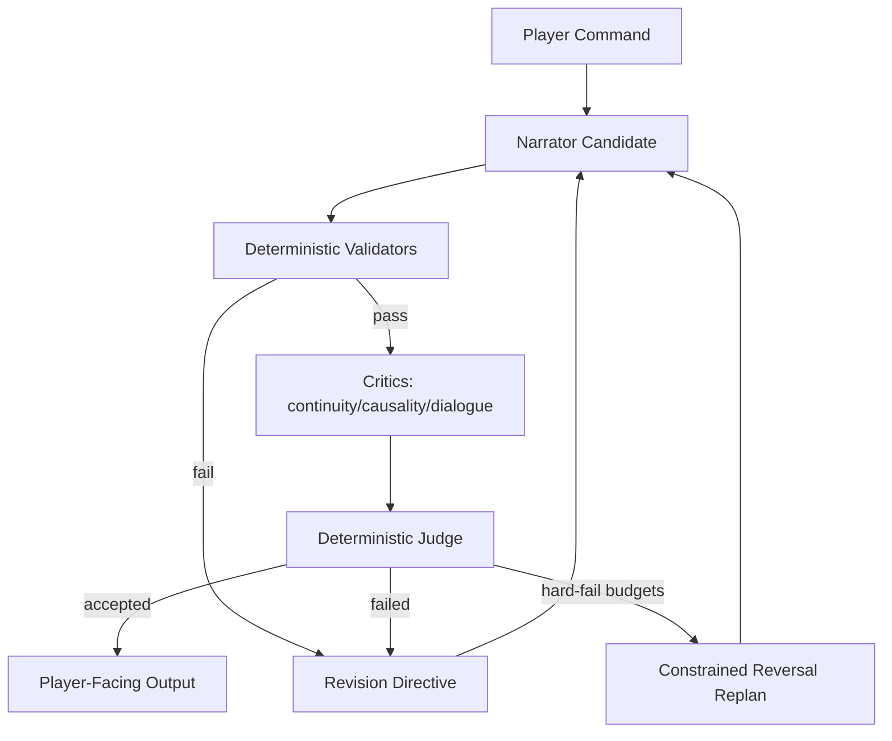

# Freytag Forge

## Executive Summary
Freytag Forge is a deterministic interactive-fiction engine built around a multi-agent narrative pipeline.
Instead of trusting a single narrator pass, it routes each candidate turn through specialist critics and a deterministic judge, improving continuity, causality, and dialog fit before output is shown to the player.
The result is stronger story coherence turn-to-turn, with reproducible behavior and auditable decision traces.


## Main Features
- Deterministic world simulation with seed-stable replay.
- Multi-agent coherence architecture:
  narrator proposal -> validator gates -> multi-critic review -> single deterministic judge -> revision/replan when needed.
- IF-style output contract with room-first narration and transcript command echo (`>COMMAND`).
- Multi-critic coherence gate with deterministic judge decisions.
- Deterministic validation gates before critique scoring.
- Hard budget limits and constrained reversal recovery path.
- Canonical `StoryState.json` + `STORY.md` artifacts with integrity checks.
- Strict typed contracts for agent I/O and deterministic contract error typing.

For detailed product/design/architecture notes, see [docs/PRD.md](docs/PRD.md).

## Run the Application

### 0) Install tooling and Python dependencies:

- Install [Python](https://www.python.org) 3.10+
- Install [uv](https://docs.astral.sh/uv/)

### 5) Configure narrator backends
Default narrator mode is `mock`, which requires no external setup.

OpenAI setup:
```bash
export OPENAI_API_KEY="your_api_key"
export OPENAI_MODEL="gpt-4o-mini"  # optional
uv run python -m storygame --seed 123 --narrator openai
```

Ollama setup:
```bash
ollama serve
ollama pull llama3.2
export OLLAMA_MODEL="llama3.2"  # optional
export OLLAMA_BASE_URL="http://localhost:11434/api/chat"  # optional
uv run python -m storygame --seed 123 --narrator ollama
```

Notes:
- Ollama local usage does not require an API key.
- If you omit `--narrator`, CLI uses `mock`.

### 1) Install dependencies
```bash
make install
```

### 4) Run 
```bash
make run
```
Open `http://127.0.0.1:8000`.

