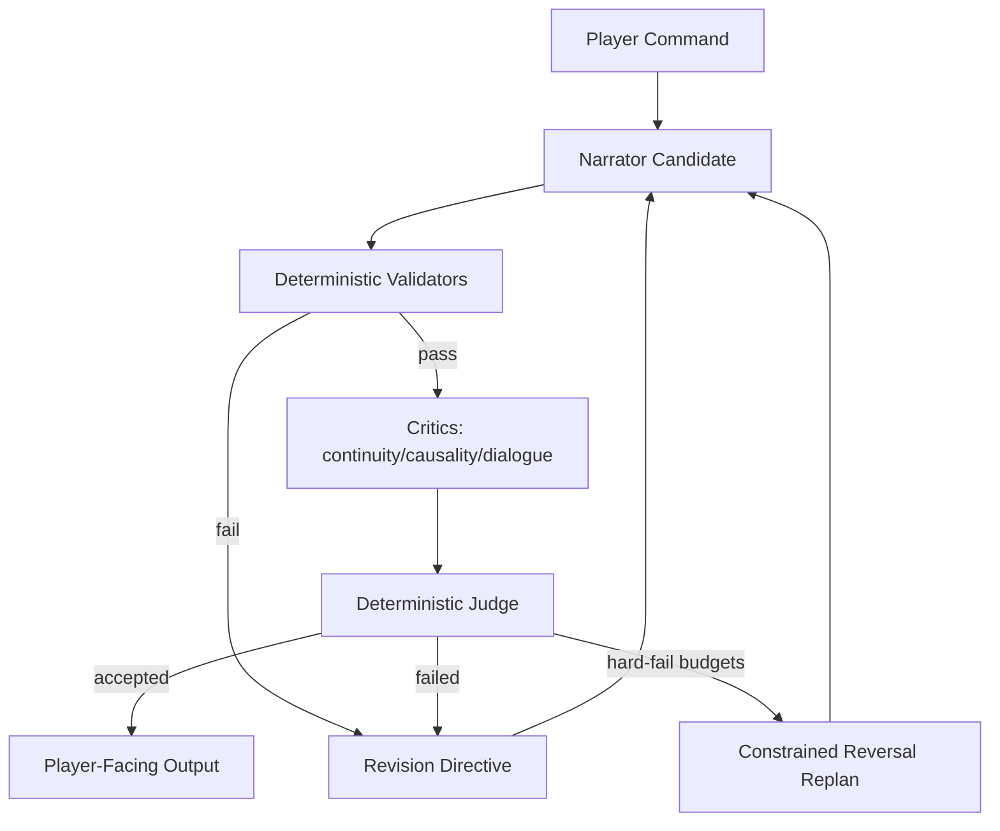

# Freytag Forge

## Executive Summary
Freytag Forge is a deterministic interactive-fiction engine built around a multi-agent narrative pipeline.
Instead of trusting a single narrator pass, it routes each candidate turn through specialist critics and a deterministic judge, improving continuity, causality, and dialog fit before output is shown to the player.
The result is stronger story coherence turn-to-turn, with reproducible behavior and auditable decision traces.
Worlds are now generated from genre/tone/session inputs at startup.


## Agent Definitions
Agent behavior is centered in [storygame/llm/coherence.py](storygame/llm/coherence.py), with contract shapes in [storygame/llm/contracts.py](storygame/llm/contracts.py) and narrator backends in [storygame/llm/adapters.py](storygame/llm/adapters.py).
Story-design agent orchestration is implemented in [storygame/llm/story_director.py](storygame/llm/story_director.py), with explicit per-agent prompt builders in [storygame/llm/story_agents/prompts.py](storygame/llm/story_agents/prompts.py) and JSON contracts in [storygame/llm/story_agents/contracts.py](storygame/llm/story_agents/contracts.py).

There are **5 narrative agents** in the default pipeline:
- **1 narrator** (`agent_id="narrator"`): proposes candidate narration each round.
- **3 critics** (`continuity`, `causality`, `dialogue_fit`): score and provide focused feedback.
- **1 judge** (`judge="director"`): deterministically accepts/fails rounds using thresholds/floors.

Story-quality checks now enforced in prompts/revision directives:
- Opening setup guidance: 3-4 paragraphs, establish who/where/immediate objective, keep future twists hidden.
- Turn-order guidance: room name -> room description -> items in prose -> exits -> NPC/background activity.
- Continuity revisions explicitly call out setup anchors and spoiler discipline when continuity is weakest.
- Opening scene now passes through a deterministic story-editor pass before display to strip legacy/meta phrasing and repair obvious coherence issues.
- Every player-facing output now passes through an output-editor gate; when narrator mode is `openai` or `ollama`, this gate uses an LLM critic pass and falls back to deterministic editing if unavailable.

There are also **4 deterministic validators** run before critics:
- `entity_reachability`
- `inventory_location_consistency`
- `committed_state_contradiction`
- `beat_transition_legality`

So the default coherence pipeline has **9 total decision participants** (5 narrative agents + 4 validators).
## Main Features
- Deterministic world simulation with seed-stable replay.
- Package-driven world realization:
  generated `world_package` metadata (map/entities/items/goals) is realized into playable runtime rooms, NPCs, and items at startup.
- Multi-agent coherence architecture:
  narrator proposal -> validator gates -> multi-critic review -> single deterministic judge -> revision/replan when needed.
- Beat realization layer for concrete story incidents:
  timed and trigger-based incidents can materialize beat themes into in-world events without relying on fixed room/item IDs.
- IF-style output contract with room-first narration and transcript command echo (`>COMMAND`).
- Freeform roleplay fallback for non-command text with policy-bounded fact updates.
- Non-debug output stays diegetic: plain room title/prose, no engine bullets, and no rubric internals.
- Multi-critic coherence gate with deterministic judge decisions.
- Deterministic validation gates before critique scoring.
- Hard budget limits and constrained reversal recovery path.
- Canonical `StoryState.json` + `STORY.md` artifacts with integrity checks.
- Canonical artifact trace chaining via `trace.parent_story_state_sha256`.
- Per-turn artifact history snapshots under `story_artifacts/<slot>/turns/<turn_index>/`.
- Strict typed contracts for agent I/O and deterministic contract error typing.

For detailed product/design/architecture notes, see [docs/PRD.md](docs/PRD.md).

## Incident Authoring
- Incident content is now defined in [storygame/content/incidents.yaml](storygame/content/incidents.yaml).
- Incident defaults are now world-agnostic (no hard dependency on specific legacy room or NPC IDs).
- Supported trigger primitives include:
  - `min_turn`, `cooldown_turns`
  - boolean groups: `all`, `any`, `not`
  - condition keys: `location_is`, `item_in_inventory`, `flag_is_true`, `progress_at_least`
  - action/event keys: `action_type`, `entity`, `event` (including `player_entered_room`)
  - ordered history matching via `sequence.steps` with `within_turns`

## Run the Application

### 1) Install Python tooling:

- Install [Python](https://www.python.org) 3.10+
- Install [uv](https://docs.astral.sh/uv/)

### 2) Configure narrator backends
Narration requires an LLM backend (`openai` or `ollama`).

OpenAI setup:
```bash
export OPENAI_API_KEY="your_api_key"
export OPENAI_MODEL="gpt-4o-mini"  # optional
uv run python -m storygame --seed 123 --narrator openai
```

Ollama setup:
```bash
ollama serve
ollama pull llama3.2
export OLLAMA_MODEL="llama3.2"  # optional
export OLLAMA_BASE_URL="http://localhost:11434/api/chat"  # optional
uv run python -m storygame --seed 123 --narrator ollama
```

Notes:
- Ollama local usage does not require an API key.
- Web mode (`make run`) resolves narrator automatically in this order:
  1. `FREYTAG_NARRATOR` (if set to `openai|ollama`)
  2. `OPENAI_API_KEY` -> `openai`
  3. `OLLAMA_BASE_URL` or `OLLAMA_MODEL` -> `ollama`
  4. default `openai`

Examples:
```bash
# Force web mode to use OpenAI
export FREYTAG_NARRATOR=openai
export OPENAI_API_KEY="your_api_key"
make run
```

### 3) Install dependencies
```bash
make install
```

### 4) Run 
```bash
make run
```
Open `http://127.0.0.1:8000`.

Optional CLI run (same runtime engine):
```bash
uv run python -m storygame --seed 123 --genre fantasy --session-length long --tone epic
```
