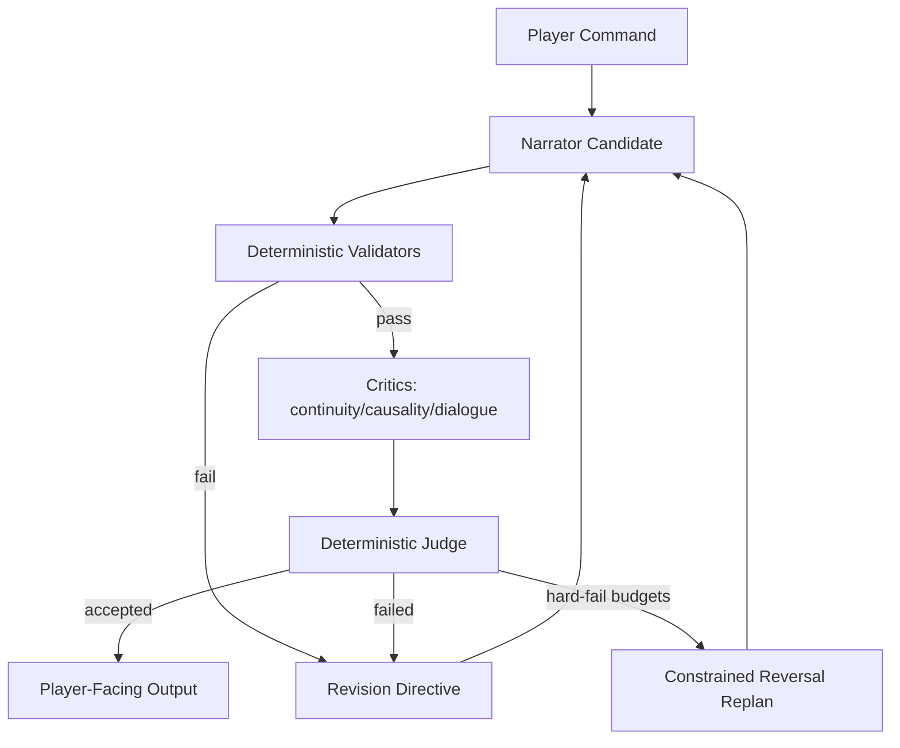

# Freytag Forge

## Executive Summary
Freytag Forge is a deterministic interactive-fiction engine built around a multi-agent narrative pipeline.
Instead of trusting a single narrator pass, it routes each candidate turn through specialist critics and a deterministic judge, improving continuity, causality, and dialogue fit before output is shown to the player.
The result is stronger story coherence turn-to-turn, with reproducible behavior and auditable decision traces.


## Main Features
- Deterministic world simulation with seed-stable replay.
- Multi-agent coherence architecture:
  narrator proposal -> validator gates -> multi-critic review -> single deterministic judge -> revision/replan when needed.
- IF-style output contract with room-first narration and transcript command echo (`>COMMAND`).
- Multi-critic coherence gate with deterministic judge decisions.
- Deterministic validation gates before critique scoring.
- Hard budget limits and constrained reversal recovery path.
- Canonical `StoryState.json` + `STORY.md` artifacts with integrity checks.
- Strict typed contracts for agent I/O and deterministic contract error typing.

For detailed product/design/architecture notes, see [docs/PRD.md](docs/PRD.md).

## Run the Application

### 1) Install dependencies
```bash
uv sync
```

### 2) Run CLI mode
```bash
uv run python -m storygame --seed 123
```

### 3) Run replay + transcript
```bash
uv run python -m storygame --seed 123 --replay runs/demo_commands.txt --transcript runs/demo_transcript.txt
```

### 4) Run web mode
```bash
uv run uvicorn storygame.web:app --reload
```
Open `http://127.0.0.1:8000`.
