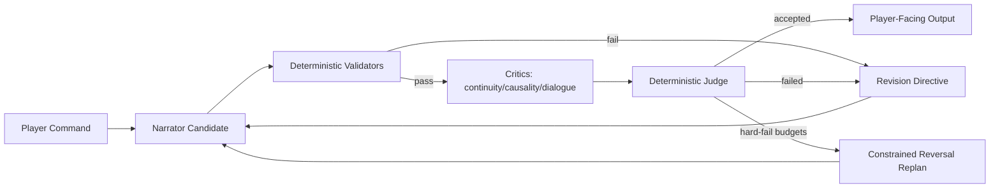

# Freytag Forge PRD

## Product Intent
Freytag Forge is a deterministic narrative-engine platform for interactive fiction. It aims to blend strong IF usability with modern, testable narration controls and reproducible evaluation.

## Goals
- Deliver a playable CLI and web IF experience.
- Keep world-state progression deterministic and replayable.
- Improve narration quality via bounded, reproducible coherence workflows.
- Persist canonical artifacts with traceability and integrity enforcement.
- Enforce explicit typed contracts at agent boundaries.

## Project Layout
```text
.
├── storygame/
│   ├── cli.py
│   ├── web.py
│   ├── engine/
│   ├── llm/
│   ├── persistence/
│   ├── plot/
│   └── memory.py
├── tests/
├── .plans/
├── runs/
├── Makefile
├── pyproject.toml
└── README.md
```

## Tool Stack
- Language/runtime: Python 3.12
- Package/runtime tooling: `uv`
- Web/API: FastAPI + Uvicorn
- Testing: pytest + pytest-cov
- Linting/format rules: Ruff
- Persistence: SQLite (save snapshots + vector memory)

## Architecture Overview
### Core Engine
- `storygame.engine` handles command parsing, world rules, state transitions, and event emission.
- Plot progression is controlled by Freytag phase/tension modules under `storygame.plot`.

### Narration + Coherence
- `storygame.llm.adapters` defines narrator integrations (`mock`, `none`, `openai`, `ollama`).
- `storygame.llm.context` constructs constrained narration context.
- `storygame.llm.coherence` runs deterministic multi-critic scoring, judging, budgets, telemetry, and constrained reversal.
- `storygame.llm.contracts` defines and validates strict typed contracts:
  - `AgentProposal`
  - `StoryPatch`
  - `CritiqueReport`
  - `JudgeDecision`
  - `RevisionDirective`



### Persistence + Canonical Artifacts
- `storygame.persistence.savegame_sqlite` stores run snapshots/events/transcripts.
- `storygame.persistence.story_state` emits canonical turn artifacts:
  - `StoryState.json`
  - `STORY.md`
- Artifact integrity is enforced by hash checks and orchestrator-only write constraints.

## Feature Details
### Output Contract
- Non-debug mode keeps player-facing, diegetic output.
- Turn output is room-first.
- Non-debug path surfaces clarity prompts for invalid/unknown actions.
- Transcript command echo uses `>COMMAND` format.
- Debug mode includes parseable structured trace via `[debug-json] ...`.

### Coherence Gate
- Critics: `continuity`, `causality`, `dialogue_fit`.
- Judge: deterministic single arbiter with fixed weighted rubric.
- Threshold and critical floors are enforced deterministically.
- Hard limits: rounds, per-role tokens, wall-clock timeout.
- Retryable hard-fails use reversal seeding with preserved/modified/discarded delta reporting.

### Deterministic Validators
- Entity reachability
- Inventory/location consistency
- Committed-state contradiction checks
- Beat-transition legality

### Evaluation Harness
- Fixed-seed regression tests for replay stability.
- Output contract tests for debug/non-debug boundaries.
- Contract parser tests for malformed payload rejection.

## CLI and Runtime Modes
- CLI: `uv run python -m storygame --seed 123`
- Replay: `--replay <file> --transcript <file>`
- Web: `uv run uvicorn storygame.web:app --reload`
- Narrator mode: `--narrator mock|none|openai|ollama`

## Environment Variables
### OpenAI adapter
- `OPENAI_API_KEY`
- `OPENAI_MODEL` (default `gpt-4o-mini`)
- `OPENAI_TIMEOUT` (default `10.0`)
- `OPENAI_BASE_URL`
- `OPENAI_TEMPERATURE` (default `0.2`)
- `OPENAI_MAX_TOKENS` (default `512`)

### Ollama adapter
- `OLLAMA_MODEL` (default `llama3.2`)
- `OLLAMA_TIMEOUT` (default `180.0`)
- `OLLAMA_BASE_URL` (default `http://localhost:11434/api/chat`)
- `OLLAMA_TEMPERATURE` (default `0.2`)
- `OLLAMA_MAX_TOKENS` (default `512`)

## Developer Workflow
```bash
uv sync --group dev
uv run pre-commit install
uv run pre-commit run --all-files
uv run python -m pytest -q
uv run python -m ruff check .
```

## Open Product Questions
- Should web mode expose debug JSON traces in UI by default or behind a stricter flag?
- Should transcript format optionally preserve original command casing in addition to `>COMMAND` normalization?
- Should PRD include formal non-goals and release acceptance criteria per milestone?
