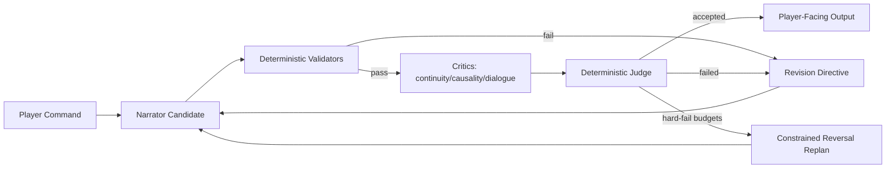

# Freytag Forge PRD

## Product Intent
Freytag Forge is a deterministic narrative-engine platform for interactive fiction. It aims to blend strong IF usability with modern, testable narration controls and reproducible evaluation.
Current runtime generation is package-driven.

## Goals
- Deliver a playable CLI and web IF experience.
- Keep world-state progression deterministic and replayable.
- Improve narration quality via bounded, reproducible coherence workflows.
- Persist canonical artifacts with traceability and integrity enforcement.
- Enforce explicit typed contracts at agent boundaries.

## Project Layout
```text
.
├── storygame/
│   ├── cli.py
│   ├── web.py
│   ├── web_demo.py
│   ├── engine/
│   ├── llm/
│   ├── persistence/
│   ├── plot/
│   └── memory.py
├── tests/
├── .plans/
├── runs/
├── Makefile
├── pyproject.toml
└── README.md
```

## Tool Stack
- Language/runtime: Python 3.12
- Package/runtime tooling: `uv`
- Web/API: FastAPI + Uvicorn
- Testing: pytest + pytest-cov
- Linting/format rules: Ruff
- Persistence: SQLite (save snapshots + vector memory)

## Architecture Overview
### Core Engine
- `storygame.engine` handles command parsing, world rules, state transitions, and event emission.
- Turn routing is planner-first for gameplay inputs: LLM/freeform action proposals are interpreted before dispatching to deterministic engine actions or bounded freeform policy envelopes.
- Deterministic parser handling is retained for control-plane commands (`save`, `load`, `quit`) and planner-failure fallback.
- Runtime world truth is fact-based (`at`, `holding`, `path`, `locked`, `flag`, etc.) with legacy object views synchronized for compatibility.
- `storygame.engine.world_builder` selects outline + curve + map/entities/items metadata (`world_package`) by genre/tone/session.
- `storygame.engine.world` realizes that package into playable runtime `WorldState` at startup.
- Plot progression is controlled by Freytag phase/tension modules under `storygame.plot`.
- `storygame.engine.incidents` realizes abstract beats into concrete in-world incidents with deterministic trigger logic.

### Narration + Coherence
- `storygame.llm.adapters` defines narrator integrations (`openai`, `ollama`, `cloudflare_workers_ai`).
- `storygame.llm.context` constructs constrained narration context.
- `storygame.llm.coherence` runs deterministic multi-critic scoring, judging, budgets, telemetry, and constrained reversal.
- Multi-critic evaluation executes critic runs in parallel per round while preserving deterministic output ordering for judge inputs.
- `storygame.llm.story_director` orchestrates story-design LLM agents (architect/character/plot/narrator/editor).
- Opening orchestration runs dependency-ordered stages first (architect -> character -> plot), then executes room-presentation caching and narrator opening generation in parallel to reduce latency.
- `storygame.llm.story_agents.prompts` defines per-agent prompt templates.
- `storygame.llm.story_agents.contracts` defines per-agent JSON contracts and parsers.
- Story-agent parsers enforce required JSON keys but normalize lightweight label/punctuation variants and ignore non-contract extra fields to reduce brittle generation failures.
- `storygame.llm.contracts` defines and validates strict typed contracts:
  - `AgentProposal`
  - `StoryPatch`
  - `CritiqueReport`
  - `JudgeDecision`
  - `RevisionDirective`



### Persistence + Canonical Artifacts
- `storygame.persistence.savegame_sqlite` stores run snapshots/events/transcripts.
- `storygame.persistence.story_state` emits canonical turn artifacts:
  - `StoryState.json`
  - `STORY.md`
- Artifact integrity is enforced by hash checks and orchestrator-only write constraints.
- Each artifact trace includes `parent_story_state_sha256` to link canonical snapshots across persisted turns.
- Per-turn artifact history is retained under `story_artifacts/<slot>/turns/<turn_index>/`.

### Web Surfaces
- `storygame.web` is the local/dev web surface with embedded UI (`GET /`) and turn endpoint (`POST /turn`) keyed by `run_id`.
- `storygame.web_demo` is the hosted-demo API surface:
  - `GET /api/v1/health`
  - `POST /api/v1/session`
  - `POST /api/v1/turn`
- Hosted-demo sessions use explicit TTL expiry with server-side `session_id` continuity.
- Demo app save/load slots are scoped by `session_id` for deterministic isolation.
- Demo app enforces guardrails:
  - per-IP short-window rate limit,
  - per-IP daily turn cap,
  - per-session turn cap.
- Demo `/api/v1/turn` now returns typed fail-closed statuses for hosted clients:
  - `rate_limited` (HTTP 429),
  - `quota_exhausted` (HTTP 429),
  - `service_unavailable` (HTTP 503),
  - `ok` (HTTP 200).

## Feature Details
### Beat Realization
- Abstract Freytag beats are realized as concrete incidents (for example: panic spikes, interrupted briefings, forged directives).
- Incident triggers are deterministic and may depend on:
  - turn timing (`min_turn`),
  - player location,
  - inventory requirements,
  - recent action-event patterns (for example specific `talk`/`take` activity).
- Incidents are one-shot via explicit per-incident flags and can adjust progress/tension.
- Incident definitions are authored in `storygame/content/incidents.yaml`.
- Trigger schema supports boolean groups (`all`/`any`/`not`), `cooldown_turns`, and ordered event `sequence` matching.
- If no incident matches the current beat context, the engine falls back to generic beat-tagged plot templates.

### World Builder Interfaces
- Runtime map/entity/item realization is derived from `world_package` (selected from outline + curve templates) rather than static scene constants.
- Predicate and rule packs are YAML-defined:
  - `data/predicates/core.yaml`
  - `data/predicates/genres/<genre>.yaml`
  - `data/rules/core_rules.yaml`
  - `data/rules/genres/<genre>_rules.yaml`
- NPC voice cards are defined in `data/npc_voice_cards.yaml`.
- Generated runtime NPCs now receive deterministic binary pronouns (`she/her` or `he/him`) inferred from likely first-name gender, replacing the previous universal `they/them` default.
- Runtime contract validators cover:
  - `ActionProposal`
  - `DialogProposal`
  - `StateUpdateEnvelope`
- Gameplay intent resolution uses a planner-first path:
  - Default freeform adapter attempts an LLM planner first (strict `DialogProposal`/`ActionProposal` JSON contracts).
  - Planner outputs are either mapped to deterministic engine actions (for canonical IF intents) or handled as bounded `freeform_roleplay`.
  - If planner output is invalid/unavailable, deterministic fallback proposal logic is used.
- Freeform adapters produce `DialogProposal` + `ActionProposal`.
- Engine policy maps proposals into bounded `StateUpdateEnvelope` fact deltas before commit.
- Unknown or out-of-policy freeform intents now use a generic policy fallback that still records deterministic world-state facts (intent/target flags) and applies bounded story deltas, rather than silently no-oping.
- Critical setup commands like `read/review case file` are deterministically recognized at policy boundary and commit explicit world facts (for example `reviewed_case_file`) to guarantee command follow-through.

### Output Contract
- Non-debug mode keeps player-facing, diegetic output.
- Turn output is room-first.
- Room output uses plain title + prose layout (no bracketed room labels, no event bullet prefixes).
- Room presentation now uses cached long/short descriptions per location: `LOOK` renders long form; non-LOOK turns render short form.
- Story prompts enforce opening-scene guidance for turn 0 (3-4 paragraphs with who/where/immediate objective).
- Opening/goal language is normalized to keep assistant-role continuity (for example, `first contact` instead of conflicting `first witness` phrasing when the assistant is the first NPC partner).
- When plot/objective text frames the assistant as a suspect, objective language is rewritten to target a separate suspect contact (or a generic suspect fallback) so the assistant remains an ally role in the opening.
- Opening scene paragraphs are rendered with blank-line separation in CLI output/transcripts for readability.
- Web turn responses now also preserve opening paragraph spacing with explicit blank-line separators.
- Web bootstrap response (`start`/`look` on a fresh run) returns opening scene text plus the initial room block.
- First substantive command in a fresh web run no longer prepends opening text; it returns only the command echo + turn body.
- Opening intro combines protagonist name and background in one natural sentence (for example, `You are <name>, <background>.`) with punctuation normalization.
- Opening generation now fails soft: if narrator-opening contract parsing fails, a deterministic fallback opening is used instead of surfacing a 500 error.
- Story prompts enforce spoiler discipline (later twists are withheld until revealed by progression/events).
- Revision directives reinforce turn sequencing priorities: room name, room description, items, exits, then NPC/background.
- A deterministic opening-scene story editor runs before display to remove legacy/meta phrasing and fix obvious narrative incoherence.
- Output editor gate runs on every user-facing response via an LLM critic rewrite pass (OpenAI/Ollama).
- Turn output retains an explicit LLM narration line when generation succeeds; if downstream review strips it, the original narration is reattached.
- Turn narration is action-grounded: if a generated narration omits meaningful tokens from the player’s command, a deterministic action-reference prefix is added.
- Per-turn rendering is LLM-first: when narrator output is available, deterministic room/event blocks are not shown; deterministic room/event rendering remains fallback-only for empty/invalid narrator proposals.
- Coherence contract failures are fail-soft for turn rendering: revision-directive contract errors trigger a direct narrator fallback for that turn rather than exposing internal contract error strings to the player.
- Coherence wall-clock hard-fails (`BUDGET_WALL_CLOCK_TIMEOUT`) discard the failed narrator draft and fall back to deterministic room/event rendering for continuity.
- Legacy signal/resonance hint copy has been removed from normal room output.
- Turn intent routing is planner-first: gameplay inputs are interpreted through the LLM/freeform action proposal path, then mapped into deterministic engine actions or bounded freeform envelopes.
- Deterministic parser paths are retained as control-plane/fallback guards (`save`, `load`, `quit`, and planner-failure fallback) so state mutation remains reproducible.
- Freeform NPC replies are normalized to explicit dialogue format: `<Character> says: "<reply>"`.
- Freeform turns also run through the same narrator/coherence pipeline as command turns, so player prompts receive an LLM narration response in addition to policy-bounded state updates.
- Policy-impossible freeform actions return constrained boundary responses with no state mutation.
- High-impact commands are detected generically (safety/legal/social/goal disruption) and require explicit `PROCEED`/`CANCEL` confirmation before mutation.
- Confirmed high-impact choices emit a `major_disruption` marker and replan context so story agents can adapt goals, event timing, and NPC behavior.
- Transcript command echo uses `>COMMAND` format.
- CLI/replay transcripts insert a blank line before each `>COMMAND` echo for readability between turns.
- Web turn response lines now prepend `>COMMAND` each turn for transcript-style continuity in clients.
- Debug mode includes parseable structured trace via `[debug-json] ...`.
- Debug traces for freeform turns include planner/policy diagnostics (`action_proposal` including planner source/error, envelope reasons, applied fact ops, and story delta) to explain why and how state changed.

### Coherence Gate
- Critics: `continuity`, `causality`, `dialogue_fit`.
- Critic score payloads use explicit `ScoreVector` contract keys (`continuity`, `causality`, `dialogue_fit`) for static and runtime validation alignment.
- Judge: deterministic single arbiter with fixed weighted rubric.
- Threshold and critical floors are enforced deterministically.
- Hard limits: rounds, per-role tokens, wall-clock timeout.
- Retryable hard-fails use reversal seeding with preserved/modified/discarded delta reporting.

### Deterministic Validators
- Entity reachability
- Inventory/location consistency
- NPC presence consistency (off-screen NPCs cannot be narrated as present in-room)
- Committed-state contradiction checks
- Beat-transition legality

### Evaluation Harness
- Fixed-seed regression tests for replay stability.
- Output contract tests for debug/non-debug boundaries.
- Contract parser tests for malformed payload rejection.

## CLI and Runtime Modes
- CLI: `uv run python -m storygame --seed 123`
- CLI with story profile: `uv run python -m storygame --seed 123 --genre mystery --session-length medium --tone neutral`
- Replay: `--replay <file> --transcript <file>`
- Web: `uv run uvicorn storygame.web:app --reload`
- Narrator mode: `--narrator openai|ollama`
- Web narrator resolution precedence (when not explicitly passed in `create_app(...)`):
  1. `FREYTAG_NARRATOR` (`openai|ollama`)
  2. `OPENAI_API_KEY` => `openai`
  3. `OLLAMA_BASE_URL` or `OLLAMA_MODEL` => `ollama`
  4. default `openai`

## Environment Variables
### Runtime selection
- `FREYTAG_NARRATOR`

### OpenAI adapter
- `OPENAI_API_KEY`
- `OPENAI_MODEL` (default `gpt-4o-mini`)
- `OPENAI_TIMEOUT` (default `10.0`)
- `OPENAI_BASE_URL`
- `OPENAI_TEMPERATURE` (default `0.2`)
- `OPENAI_MAX_TOKENS` (default `512`)

### Ollama adapter
- `OLLAMA_MODEL` (default `llama3.2`)
- `OLLAMA_TIMEOUT` (default `180.0`)
- `OLLAMA_BASE_URL` (default `http://localhost:11434/api/chat`)
  - Host-only values (for example `http://localhost:11434`) are normalized to `/api/chat` for story-agent requests.
- `OLLAMA_TEMPERATURE` (default `0.2`)
- `OLLAMA_MAX_TOKENS` (default `512`)

### Cloudflare Workers adapter (demo mode)
- `CLOUDFLARE_WORKER_URL`
- `CLOUDFLARE_WORKER_TOKEN` (optional, depending on worker auth config)
- `CLOUDFLARE_TIMEOUT` (default `20.0`)

### Demo API guardrails
- `SESSION_TTL_SECONDS` (app default 1800)
- `SESSION_TURN_CAP` (app default 30)
- `IP_RATE_LIMIT_PER_MIN` (app default 20)
- `IP_DAILY_TURN_CAP` (app default 300)

## Developer Workflow
```bash
uv sync --group dev
uv run pre-commit install
uv run pre-commit run --all-files
uv run python -m pytest -q
uv run python -m ruff check .
```

## Open Product Questions
- Should web mode expose debug JSON traces in UI by default or behind a stricter flag?
- Should transcript format optionally preserve original command casing in addition to `>COMMAND` normalization?
- Should PRD include formal non-goals and release acceptance criteria per milestone?
