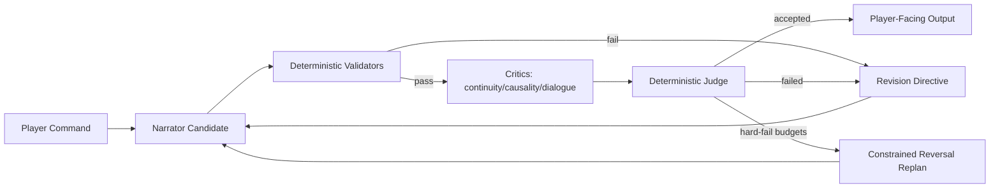

# Freytag Forge PRD

## Product Intent
Freytag Forge is a deterministic narrative-engine platform for interactive fiction. It aims to blend strong IF usability with modern, testable narration controls and reproducible evaluation.
Current runtime generation is package-driven.

## Goals
- Deliver a playable CLI and web IF experience.
- Keep world-state progression deterministic and replayable.
- Let LLMs drive ordinary in-scope story progression, NPC dialogue, and turn framing inside deterministic safety rails.
- Improve narration quality via bounded, reproducible coherence workflows.
- Persist canonical artifacts with traceability and integrity enforcement.
- Enforce explicit typed contracts at agent boundaries.

## Project Layout
```text
.
├── storygame/
│   ├── cli.py
│   ├── web.py
│   ├── web_demo.py
│   ├── engine/
│   ├── llm/
│   ├── persistence/
│   ├── plot/
│   └── memory.py
├── frontend/
├── tests/
├── .plans/
├── .github/workflows/
├── runs/
├── Makefile
├── pyproject.toml
└── README.md
```

## Tool Stack
- Language/runtime: Python 3.12
- Package/runtime tooling: `uv`
- Web/API: FastAPI + Uvicorn
- Testing: pytest + pytest-cov
- Linting/format rules: Ruff
- Persistence: SQLite (save snapshots + vector memory)

## Architecture Overview
### Design Delta: LLM-Driven Runtime Within Deterministic Guardrails
- Ordinary gameplay turns are story-first, not parser-first.
- The LLM is the default author of:
  - NPC dialogue,
  - immediate turn framing,
  - in-scope action interpretation,
  - candidate story consequences,
  - candidate beat/event suggestions.
- Deterministic systems remain the sole authority for:
  - world-state commits,
  - fact validation,
  - inventory/location legality,
  - map reachability,
  - persistence,
  - replay signatures,
  - bounded acceptance/rejection of LLM proposals.
- The engine must not reduce ordinary turns to a small parser command set unless:
  - the player used an explicit control-plane command,
  - the LLM proposal is invalid,
  - the proposal fails deterministic validators,
  - or the requested action is intentionally out of story scope.
- Out-of-scope or high-impact actions are handled by explicit confirmation:
  - engine explains why the action exceeds current story bounds,
  - player chooses `PROCEED` or `CANCEL`,
  - confirmed `PROCEED` triggers deterministic state markers plus story replanning of goals, NPC behavior, likely consequences, and event timing.
- Product intent for runtime feel:
  - the game should feel like a responsive story simulation with deterministic enforcement,
  - not a classic command parser with LLM text layered on top.

### Core Engine
- `storygame.engine` handles command parsing, world rules, state transitions, and event emission.
- Turn routing is proposal-first for gameplay inputs: LLM runtime proposals are the default control path for all ordinary turns.
- Deterministic parser handling is retained only for control-plane commands (`save`, `load`, `quit`, `help`) and proposal-failure fallback.
- Runtime world truth is fact-based (`at`, `holding`, `path`, `locked`, `flag`, etc.) with legacy object views synchronized for compatibility.
- `storygame.engine.world_builder` selects outline + curve + map/entities/items metadata (`world_package`) by genre/tone/session.
- `storygame.engine.world` realizes that package into playable runtime `WorldState` at startup.
- Plot progression is controlled by Freytag phase/tension modules under `storygame.plot`.
- `storygame.engine.incidents` realizes abstract beats into concrete in-world incidents with deterministic trigger logic.
- A dedicated turn-orchestration layer accepts structured candidate proposals from the LLM and commits only validated deltas to canonical world state.
- Deterministic engine actions are an adapter target for proposal execution, not the primary authored experience for ordinary narrative turns.

### Narration + Coherence
- `storygame.llm.adapters` defines narrator integrations (`openai`, `ollama`, `cloudflare_workers_ai`).
- `storygame.llm.context` constructs constrained narration context.
- `storygame.llm.coherence` runs deterministic multi-critic scoring, judging, budgets, telemetry, and constrained reversal.
- Multi-critic evaluation executes critic runs in parallel per round while preserving deterministic output ordering for judge inputs.
- `storygame.llm.story_director` orchestrates story-design LLM agents (architect/character/plot/narrator/editor).
- Opening orchestration runs dependency-ordered stages first (architect -> character -> plot), then executes room-presentation caching and narrator opening generation in parallel to reduce latency.
- `storygame.llm.story_agents.prompts` defines per-agent prompt templates.
- `storygame.llm.story_agents.contracts` defines per-agent JSON contracts and parsers.
- Story-agent parsers enforce required JSON keys but normalize lightweight label/punctuation variants and ignore non-contract extra fields to reduce brittle generation failures.
- `storygame.llm.contracts` defines and validates strict typed contracts:
  - `AgentProposal`
  - `StoryPatch`
  - `CritiqueReport`
  - `JudgeDecision`
  - `RevisionDirective`
- Runtime turn contracts must expand so the LLM can propose richer but bounded story behavior:
  - `TurnProposal`
  - `NpcReplyProposal`
  - `EventProposal`
  - `StateDeltaProposal`
  - `ReplanProposal`
- A valid runtime proposal may suggest:
  - dialogue,
  - room-facing narration,
  - NPC reactions,
  - event candidates,
  - bounded fact mutations,
  - bounded numeric deltas,
  - and beat advancement hints.
- Deterministic validation decides which parts are committed, revised, or rejected before the player-facing turn is finalized.



### Persistence + Canonical Artifacts
- `storygame.persistence.savegame_sqlite` stores run snapshots/events/transcripts.
- `storygame.persistence.story_state` emits canonical turn artifacts:
  - `StoryState.json`
  - `STORY.md`
- Artifact integrity is enforced by hash checks and orchestrator-only write constraints.
- Each artifact trace includes `parent_story_state_sha256` to link canonical snapshots across persisted turns.
- Per-turn artifact history is retained under `story_artifacts/<slot>/turns/<turn_index>/`.

### Web Surfaces
- `storygame.web` is the local/dev web surface with embedded UI (`GET /`) and turn endpoint (`POST /turn`) keyed by `run_id`.
- Local/dev web uses the normal local narrator stack and story-agent stack:
  - narrator mode resolved from OpenAI/Ollama configuration,
  - opening/bootstrap planning may use the normal story-agent path,
  - and local misconfiguration may surface directly during development.
- `storygame.web_demo` is the hosted-demo API surface:
  - `GET /api/v1/health`
  - `POST /api/v1/session`
  - `POST /api/v1/turn`
- Hosted demo is a separate deployment surface with different narrator/backend assumptions:
  - turn narration is driven through the hosted demo adapter path (Cloudflare Worker AI / Llama when configured),
  - hosted bootstrap/opening must not require local OpenAI story-agent credentials,
  - hosted bootstrap/opening still uses story planning plus direct LLM-authored scene prose, but it must do so through the hosted backend path (for example Cloudflare Worker AI) rather than assuming local OpenAI credentials,
  - and hosted failures must fail closed with typed client responses rather than surfacing backend configuration exceptions.
- Local web and hosted demo may share payload/session/turn helpers below the adapter boundary, but they must not be refactored into a single opening/narrator path that assumes the same credential or model stack.
- `frontend/` is a minimal static GitHub Pages client for the hosted demo API. It creates a session, auto-runs `look`, and sends subsequent commands to the Railway-hosted `web_demo` backend via `VITE_API_BASE_URL`.
- Hosted-demo sessions use explicit TTL expiry with server-side `session_id` continuity.
- Demo app save/load slots are scoped by `session_id` for deterministic isolation.
- Demo app enforces guardrails:
  - per-IP short-window rate limit,
  - per-IP daily turn cap,
  - per-session turn cap.
- Demo app supports browser-based hosted clients through configurable CORS origin allowlisting.
- Cloudflare demo narrator env inputs (`CLOUDFLARE_WORKER_URL`, `CLOUDFLARE_WORKER_TOKEN`, `CLOUDFLARE_TIMEOUT`) are normalized at adapter boundaries to avoid whitespace-driven deploy breakage.
- Cloudflare demo narrator requests use bounded retries for transient upstream failures (network errors and HTTP 5xx), while still failing fast on hard errors like 403/429.
- Demo `/api/v1/turn` now returns typed fail-closed statuses for hosted clients:
  - `rate_limited` (HTTP 429),
  - `quota_exhausted` (HTTP 429),
  - `service_unavailable` (HTTP 503),
  - `ok` (HTTP 200).
- Hosted demo fail-closed narrator responses are also logged server-side with the underlying upstream error string for operator diagnosis while preserving generic client-facing error payloads.
- GitHub Pages deployment is handled by `.github/workflows/deploy-frontend-pages.yml`, using a Pages repo variable `VITE_API_BASE_URL` to point the static client at the Railway backend.

## Feature Details
### Beat Realization
- Abstract Freytag beats are realized as concrete incidents (for example: panic spikes, interrupted briefings, forged directives).
- Incident triggers are deterministic and may depend on:
  - turn timing (`min_turn`),
  - player location,
  - inventory requirements,
  - recent action-event patterns (for example specific `talk`/`take` activity).
- Incidents are one-shot via explicit per-incident flags and can adjust progress/tension.
- Incident definitions are authored in `storygame/content/incidents.yaml`.
- Trigger schema supports boolean groups (`all`/`any`/`not`), `cooldown_turns`, and ordered event `sequence` matching.
- If no incident matches the current beat context, the engine falls back to generic beat-tagged plot templates.

### World Builder Interfaces
- Runtime map/entity/item realization is derived from `world_package` (selected from outline + curve templates) rather than static scene constants.
- Predicate and rule packs are YAML-defined:
  - `data/predicates/core.yaml`
  - `data/predicates/genres/<genre>.yaml`
  - `data/rules/core_rules.yaml`
  - `data/rules/genres/<genre>_rules.yaml`
- NPC voice cards are defined in `data/npc_voice_cards.yaml`.
- Generated runtime NPCs now receive deterministic binary pronouns (`she/her` or `he/him`) inferred from likely first-name gender, replacing the previous universal `they/them` default.
- Runtime contract validators cover:
  - `ActionProposal`
  - `DialogProposal`
  - `StateUpdateEnvelope`
- Gameplay intent resolution uses an LLM-first simulation path:
  - Default runtime adapter attempts an LLM proposal first for ordinary gameplay inputs.
  - Proposal outputs are interpreted as candidate story actions and candidate story consequences, not just parser aliases.
  - Deterministic fallback command parsing is a resilience path, not the dominant authored path.
- Deterministic fallback dialogue routing resolves explicit NPC names against the visible cast before falling back, so `Daria, ...` or `ask Daria about ...` does not silently redirect to the wrong nearby character.
- Runtime adapters produce dialogue, action, event, and state-delta proposals.
- Engine policy maps proposals into bounded deterministic fact deltas before commit.
- In-scope proposals should usually yield meaningful world or relationship consequences rather than collapsing to generic flag-only bookkeeping.
- Unknown or out-of-policy intents use a generic policy fallback only as a last resort and must still preserve narrative continuity.
- Critical setup commands like `read/review case file` are deterministically recognized at policy boundary and commit explicit world facts (for example `reviewed_case_file`) to guarantee command follow-through.
- NPCs are stateful story actors:
  - their replies should usually be LLM-authored from deterministic context,
  - their knowledge, trust, availability, and goals remain deterministically tracked,
  - and their output must remain consistent with visible facts and prior reveals.
  - fallback dialogue must not auto-target a nearby NPC for unrelated player actions; if the player did not clearly address someone, the fallback should stay narrator-scoped or ask for clarification.
  - fallback dialogue must preserve identity continuity by grounding narrator and NPC outputs to the canonical protagonist and assistant names already in state.
- Item references should resolve unique shorthand naturally during deterministic validation (for example `take key` should resolve to `route key` when only one key is present and visible).

### Output Contract
- Non-debug mode keeps player-facing, diegetic output.
- Turn output is room-first.
- Room output uses plain title + prose layout (no bracketed room labels, no event bullet prefixes).
- Once an NPC has been introduced, later dialogue speaker labels should shorten to first-name-only when unambiguous, including after output-editor review.
- Room presentation now uses cached long/short descriptions per location: `LOOK` renders long form; non-LOOK turns render short form.
- Mystery navigation now matches the room copy: `front_steps` leads north into a `foyer` rather than directly into the outdoor lane chain.
- Story prompts enforce opening-scene guidance for turn 0 (3-4 paragraphs with who/where/immediate objective).
- Opening/goal language is normalized to keep assistant-role continuity (for example, `first contact` instead of conflicting `first witness` phrasing when the assistant is the first NPC partner).
- When plot/objective text frames the assistant as a suspect, objective language is rewritten to target a separate suspect contact (or a generic suspect fallback) so the assistant remains an ally role in the opening.
- Character-designer output is normalized so the seeded opening contact remains the assistant, keeping room presence, cast planning, and opening narration aligned.
- Opening scene paragraphs are rendered with blank-line separation in CLI output/transcripts for readability.
- Web turn responses now also preserve opening paragraph spacing with explicit blank-line separators.
- Web bootstrap response (`start`/`look` on a fresh run) returns opening scene text plus the initial room block.
- Hosted-demo bootstrap is an explicit compatibility boundary: it must remain playable without `OPENAI_API_KEY`, even when local web/bootstrap still uses OpenAI/Ollama story-agent paths.
- Opening prose should feel materially consistent across CLI, local web, and hosted demo: every surface should use direct LLM-authored scene prose grounded in the same planned story context, even if different backend adapters are used underneath.
- First substantive command in a fresh web run no longer prepends opening text; it returns only the command echo + turn body.
- First substantive command parity should be shared across local web and hosted demo at the story/output level, but backend integration details may differ by surface when required by deployment constraints.
- Opening intro combines protagonist name and background in one natural sentence (for example, `You are <name>, <background>.`) with punctuation normalization.
- Opening generation now fails soft: if narrator-opening contract parsing fails, a deterministic fallback opening is used instead of surfacing a 500 error.
- Story prompts enforce spoiler discipline (later twists are withheld until revealed by progression/events).
- Revision directives reinforce turn sequencing priorities: room name, room description, items, exits, then NPC/background.
- A deterministic opening-scene story editor runs before display to remove legacy/meta phrasing and fix obvious narrative incoherence.
- Output editor gate runs on every user-facing response via an LLM critic rewrite pass (OpenAI/Ollama).
- Turn output retains explicit LLM narration only when that narration is still the right player-facing surface; if downstream review strips a non-dialogue narration line, the original narration is reattached.
- Turn narration is action-grounded: if a generated narration omits meaningful tokens from the player’s command, a deterministic action-reference prefix is added.
- Per-turn rendering is hybrid: narrator output can replace deterministic room/event blocks for ordinary turns, but direct conversational freeform turns preserve bounded NPC dialogue lines instead of being rewritten into narrator prose.
- Coherence contract failures are fail-soft for turn rendering: revision-directive contract errors trigger a direct narrator fallback for that turn rather than exposing internal contract error strings to the player.
- Coherence wall-clock hard-fails (`BUDGET_WALL_CLOCK_TIMEOUT`) discard the failed narrator draft and fall back to deterministic room/event rendering for continuity.
- Legacy signal/resonance hint copy has been removed from normal room output.
- Turn intent routing is LLM-first for ordinary play: gameplay inputs are interpreted through runtime proposal contracts, then validated and committed by deterministic engine policy.
- Deterministic parser paths are retained only as control-plane/fallback guards (`save`, `load`, `quit`, `help`, and proposal-failure fallback) so state mutation remains reproducible.
- NPC replies should ordinarily be LLM-authored and context-rich; normalization to explicit dialogue format remains allowed for clarity, but the runtime should not reduce most conversations to canned or single-sentence parser responses.
- Once an NPC has been introduced by full name, later room and dialogue rendering shortens to first-name-only when the first name is unambiguous in the current room.
- Active-goal copy is treated as opening/setup material by default; later turns suppress repeated objective phrasing unless the player explicitly asks about the goal/objective.
- Asking an assistant about the current goal/objective is handled as a first-class freeform topic and returns the current deterministic `active_goal`.
- Policy-impossible freeform actions return constrained boundary responses with no state mutation.
- High-impact commands are detected generically (safety/legal/social/goal disruption) and require explicit `PROCEED`/`CANCEL` confirmation before mutation.
- Confirmed high-impact choices emit a `major_disruption` marker and replan context so story agents can adapt goals, NPC behavior, object significance, event timing, likely consequences, and future room framing.
- Transcript command echo uses `>COMMAND` format.
- CLI/replay transcripts insert a blank line before each `>COMMAND` echo for readability between turns.
- Web turn response lines now prepend `>COMMAND` each turn for transcript-style continuity in clients.
- Debug mode includes parseable structured trace via `[debug-json] ...`.
- Debug traces for runtime turns include proposal/policy diagnostics (proposal source/error, accepted vs rejected deltas, applied fact ops, event decisions, and story delta) to explain why and how state changed.

### Coherence Gate
- Critics: `continuity`, `causality`, `dialogue_fit`.
- Critic score payloads use explicit `ScoreVector` contract keys (`continuity`, `causality`, `dialogue_fit`) for static and runtime validation alignment.
- Judge: deterministic single arbiter with fixed weighted rubric.
- Threshold and critical floors are enforced deterministically.
- Hard limits: rounds, per-role tokens, wall-clock timeout.
- Retryable hard-fails use reversal seeding with preserved/modified/discarded delta reporting.

### Deterministic Validators
- Entity reachability
- Inventory/location consistency
- NPC presence consistency (off-screen NPCs cannot be narrated as present in-room)
- Committed-state contradiction checks
- Beat-transition legality

### Evaluation Harness
- Fixed-seed regression tests for replay stability.
- Output contract tests for debug/non-debug boundaries.
- Contract parser tests for malformed payload rejection.
- Runtime-behavior tests for:
  - LLM-driven in-scope dialogue actually affecting deterministic state,
  - NPC consistency across turns,
  - validator rejection of contradictory LLM proposals,
  - high-impact confirmation + replan flow,
  - and proposal-first routing staying dominant over parser fallback.

## Implementation Guardrails
- `AGENTS.md` should be treated as an implementation guardrail document for this PRD, not just a coding-style note.
- Future implementation work should preserve these runtime invariants:
  - ordinary turns must remain LLM-proposal-first,
  - deterministic systems must remain commit authorities,
  - parser fallback must stay secondary,
  - high-impact/out-of-scope actions must require confirmation before mutation,
  - and tests must lock these behaviors in before refactors land.
- If implementation begins drifting back toward parser-dominant turn handling, update `AGENTS.md` with explicit architecture rules or a required checklist for proposal-first routing and validation boundaries.

## CLI and Runtime Modes
- CLI: `uv run python -m storygame --seed 123`
- CLI with story profile: `uv run python -m storygame --seed 123 --genre mystery --session-length medium --tone neutral`
- Replay: `--replay <file> --transcript <file>`
- Web: `uv run uvicorn storygame.web:app --reload`
- Narrator mode: `--narrator openai|ollama`
- Web narrator resolution precedence (when not explicitly passed in `create_app(...)`):
  1. `FREYTAG_NARRATOR` (`openai|ollama`)
  2. `OPENAI_API_KEY` => `openai`
  3. `OLLAMA_BASE_URL` or `OLLAMA_MODEL` => `ollama`
  4. default `openai`

## Environment Variables
### Runtime selection
- `FREYTAG_NARRATOR`

### OpenAI adapter
- `OPENAI_API_KEY`
- `OPENAI_MODEL` (default `gpt-4o-mini`)
- `OPENAI_TIMEOUT` (default `10.0`)
- `OPENAI_BASE_URL`
- `OPENAI_TEMPERATURE` (default `0.2`)
- `OPENAI_MAX_TOKENS` (default `512`)

### Ollama adapter
- `OLLAMA_MODEL` (default `llama3.2`)
- `OLLAMA_TIMEOUT` (default `180.0`)
- `OLLAMA_BASE_URL` (default `http://localhost:11434/api/chat`)
  - Host-only values (for example `http://localhost:11434`) are normalized to `/api/chat` for story-agent requests.
- `OLLAMA_TEMPERATURE` (default `0.2`)
- `OLLAMA_MAX_TOKENS` (default `512`)

### Cloudflare Workers adapter (demo mode)
- `CLOUDFLARE_WORKER_URL`
- `CLOUDFLARE_WORKER_TOKEN` (optional, depending on worker auth config)
- `CLOUDFLARE_TIMEOUT` (default `20.0`)
- `CLOUDFLARE_RETRIES` (default `1`)
- `CLOUDFLARE_RETRY_BACKOFF_MS` (default `250`)

### Hosted demo frontend / CORS
- `DEMO_CORS_ALLOW_ORIGINS` (comma-separated list, default `*`)
- GitHub Pages variable: `VITE_API_BASE_URL`

### Demo API guardrails
- `SESSION_TTL_SECONDS` (app default 1800)
- `SESSION_TURN_CAP` (app default 30)
- `IP_RATE_LIMIT_PER_MIN` (app default 20)
- `IP_DAILY_TURN_CAP` (app default 300)

## Developer Workflow
```bash
uv sync --group dev
uv run pre-commit install
uv run pre-commit run --all-files
uv run python -m pytest -q
uv run python -m ruff check .
```

## Open Product Questions
- Should web mode expose debug JSON traces in UI by default or behind a stricter flag?
- Should transcript format optionally preserve original command casing in addition to `>COMMAND` normalization?
- Should PRD include formal non-goals and release acceptance criteria per milestone?
