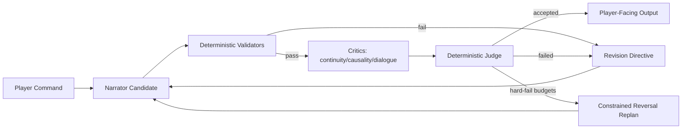

# Freytag Forge PRD

## Product Intent
Freytag Forge is a deterministic narrative-engine platform for interactive fiction. It aims to blend strong IF usability with modern, testable narration controls and reproducible evaluation.
Current runtime generation is package-driven.

## Goals
- Deliver a playable CLI and web IF experience.
- Keep world-state progression deterministic and replayable.
- Let LLMs drive ordinary in-scope story progression, NPC dialogue, and turn framing inside deterministic safety rails.
- Improve narration quality via bounded, reproducible coherence workflows.
- Persist canonical artifacts with traceability and integrity enforcement.
- Enforce explicit typed contracts at agent boundaries.

## Project Layout
```text
.
├── storygame/
│   ├── cli.py
│   ├── web.py
│   ├── web_demo.py
│   ├── engine/
│   ├── llm/
│   ├── persistence/
│   ├── plot/
│   └── memory.py
├── frontend/
├── tests/
├── .plans/
├── .github/workflows/
├── runs/
├── Makefile
├── pyproject.toml
└── README.md
```

## Tool Stack
- Language/runtime: Python 3.12
- Package/runtime tooling: `uv`
- Web/API: FastAPI + Uvicorn
- Testing: pytest + pytest-cov
- Linting/format rules: Ruff
- Persistence: SQLite (save snapshots + vector memory)

## Architecture Overview
### Design Delta: LLM-Driven Runtime Within Deterministic Guardrails
- Ordinary gameplay turns are story-first, not parser-first.
- Deterministic systems remain the sole authority for:
  - NPC initial locations,
  - NPC stable traits,
  - timed story events,
  - player characteristics,
  - item locations and item characteristics,
  - map topology and room characteristics,
  - story goals,
  - puzzles,
  - clues,
  - world-state commits,
  - world-state mutations through the fact store,
  - fact validation,
  - inventory/location legality,
  - map reachability,
  - persistence,
  - replay signatures,
  - bounded acceptance/rejection of LLM proposals.
- The LLM is the default author of:
  - opening prose,
  - turn narration,
  - NPC dialogue,
  - immediate turn framing,
  - in-scope action interpretation,
  - story presentation around deterministic facts,
  - candidate story consequences,
  - candidate beat/event suggestions.
- The engine must not reduce ordinary turns to a small parser command set unless:
  - the player used an explicit control-plane command,
  - the LLM proposal is invalid,
  - the proposal fails deterministic validators,
  - or the requested action cannot be mapped into a bounded deterministic commit.
- The player must be allowed to attempt any action or story move. Nothing is off limits at the gameplay layer; the system should adapt the story and fact state to the player prompt whenever a bounded commit is still possible.
- Non-addressed world interactions should remain scene-scoped by default. The runtime must not auto-target the nearest visible NPC or force an NPC-reply contract for player actions aimed at the environment, visible items, vehicles, exits, or room features unless the player clearly addressed or questioned that NPC.
- Goal-breaking actions are handled by explicit confirmation only when the requested prompt would break the current story goals beyond repair:
  - engine explains why the action would rupture the current story-goal structure,
  - player chooses `PROCEED` or `CANCEL`,
  - this confirmation interruption must happen before the official LLM-authored response to the original prompt,
  - confirmed `PROCEED` triggers deterministic state markers plus story replanning of NPC behavior, likely consequences, and event timing,
  - only player-confirmed major disruptions may change core story goals,
  - lighter confirmed disruptions should adapt around the current goal rather than rewriting it,
  - after `PROCEED`, the game should generate the official LLM-authored response to that same original prompt under the updated fact state.
- Product intent for runtime feel:
  - the game should feel like a responsive story simulation with deterministic enforcement,
  - not a classic command parser with LLM text layered on top.
- For direct-address conversation with a visible NPC, accepted freeform proposals must surface that NPC as the dialogue speaker. Player-speech echoes and narrator summaries are invalid substitutes for the NPC reply and should fail closed.

### Core Engine
- `storygame.engine` handles command parsing, world rules, state transitions, and event emission.
- Turn routing is proposal-first for gameplay inputs: LLM runtime proposals are the default control path for all ordinary turns.
- Deterministic parser handling is retained only for control-plane commands (`save`, `load`, `quit`, `help`).
- Navigation and inventory affordances remain deterministic engine commands even within the story-first runtime surface: `inventory`/`i` must list held items, and directional aliases like `n`/`north`/`go north`/`walk north` (and corresponding east/west/south/up/down variants) must resolve to canonical map movement with a deterministic failure message when no such exit exists.
- Runtime world truth is fact-based (`at`, `holding`, `path`, `locked`, `flag`, `story_goal`, `active_goal`, `assistant_name`, `npc_role`, `npc_relationship`, `discovered_clue`, `discovered_lead`, etc.) with legacy object views synchronized for compatibility.
- Canonical fact mutation goes through a validated commit boundary that normalizes uniqueness-sensitive writes, enforces runtime invariants, and refreshes compatibility projections after commit.
- Fact-store authority must cover goals, clues, puzzle state, NPC locations, NPC relationships, discovered leads, event flags, reveal state, and item possession/location as assertable/retractable facts.
- Scene and dramatic runtime state are now also fact-backed during transition (`current_scene`, `scene_location`, `scene_objective`, `dramatic_question`, `scene_pressure`, `beat_phase`, `beat_role`, `player_approach`, `scene_participant`).
- `storygame.llm.context.build_narration_context` should read scene/dramatic facts first and treat `progress`/`tension` as compatibility inputs when those facts are absent.
- `storygame.plot.dramatic_policy` is the compatibility policy layer that derives approach/question/role from parser turns, structured proposals, and freeform conversational turns before beat selection runs.
- `storygame.engine.world_builder` selects outline + curve + map/entities/items metadata (`world_package`) by genre/tone/session.
- `storygame.engine.bootstrap` validates LLM-expanded outline bootstrap plans before runtime state is realized.
- `storygame.engine.world` realizes that package into playable runtime `WorldState` at startup.
- `storygame.engine.world` also supports bootstrap-plan realization for sessions that start from a simple author outline expanded into structured characters, items, goals, and trigger specs.
- Plot progression is controlled by Freytag phase/tension modules under `storygame.plot`.
- `storygame.engine.incidents` realizes abstract beats into concrete in-world incidents with deterministic trigger logic.
- `storygame.engine.semantic_actions` normalizes committed semantic turn actions into canonical events plus fact-backed world mutations.
- `storygame.engine.triggers` evaluates unified action-trigger and turn-trigger specs against committed semantic events and canonical facts.
- `storygame.engine.turn_runtime` provides an additive proposal-first turn path for structured semantic turn proposals, deterministic commits, and follow-up trigger execution.
- A dedicated turn-orchestration layer accepts structured candidate proposals from the LLM and commits only validated deltas to canonical world state.
- Deterministic engine actions are an adapter target for proposal execution, not the primary authored experience for ordinary narrative turns.

### Narration + Coherence
- `storygame.llm.adapters` defines narrator integrations (`openai`, `ollama`, `cloudflare_workers_ai`).
- `storygame.llm.context` constructs constrained narration context.
- `storygame.llm.coherence` runs deterministic multi-critic scoring, judging, budgets, telemetry, and constrained reversal.
- Multi-critic evaluation executes critic runs in parallel per round while preserving deterministic output ordering for judge inputs.
- Critics and judge inputs must include canonical opening facts so review can reject contradictions between opening text and turn-based text, especially role conflicts, duplicated clue locations, and impossible physical staging.
- `storygame.llm.story_director` orchestrates story-design LLM agents (architect/character/plot/narrator/editor).
- Opening/bootstrap orchestration should prefer a single story-bootstrap agent call that returns protagonist identity, assistant/contact plan, actionable objective, longer-term goals, reveal schedule, and player-facing opening paragraphs in one contract.
- Legacy multi-agent opening chains (architect -> character -> plot -> narrator) are compatibility/fallback paths only; they are not the preferred runtime path because they waste latency budget.
- Story/bootstrap planning should be cached into runtime state once and reused rather than recomputed from deterministic seeded goal text.
- Overall latency goal: keep all story-agent interactions under 10 seconds per turn, biasing toward fewer LLM round-trips over many narrow agent calls.
- `storygame.llm.story_agents.prompts` defines per-agent prompt templates.
- `storygame.llm.story_agents.contracts` defines per-agent JSON contracts and parsers.
- Story-agent parsers enforce required JSON keys but normalize lightweight label/punctuation variants and ignore non-contract extra fields to reduce brittle generation failures.
- `storygame.llm.contracts` defines and validates strict typed contracts:
  - `AgentProposal`
  - `StoryPatch`
  - `CritiqueReport`
  - `JudgeDecision`
  - `RevisionDirective`
- Runtime turn contracts must expand so the LLM can propose richer but bounded story behavior:
  - `TurnProposal`
  - `NpcReplyProposal`
  - `EventProposal`
  - `StateDeltaProposal`
  - `ReplanProposal`
- Ordinary turn orchestration now treats `TurnProposal` as the shared runtime contract for both LLM-authored freeform turns and parser-normalized deterministic aliases such as movement, take, inventory, and look. Control-plane commands (`save`, `load`, `quit`, `help`) stay outside that contract.
- A valid runtime proposal may suggest:
  - dialogue,
  - room-facing narration,
  - NPC reactions,
  - event candidates,
  - bounded fact mutations,
  - bounded numeric deltas,
  - and beat advancement hints.
- Deterministic validation decides which parts are committed, revised, or rejected before the player-facing turn is finalized.



### Persistence + Canonical Artifacts
- `storygame.persistence.savegame_sqlite` stores run snapshots/events/transcripts.
- Save/load must preserve the fact-backed active goal and restore it back into canonical runtime facts on load.
- `storygame.persistence.story_state` emits canonical turn artifacts:
  - `StoryState.json`
  - `STORY.md`
- Artifact payloads and markdown should report the fact-backed active goal rather than stale in-memory fallback fields.
- Artifact integrity is enforced by hash checks and orchestrator-only write constraints.
- Each artifact trace includes `parent_story_state_sha256` to link canonical snapshots across persisted turns.
- Per-turn artifact history is retained under `story_artifacts/<slot>/turns/<turn_index>/`.

### Web Surfaces
- `storygame.web` is the local/dev web surface with embedded UI (`GET /`) and turn endpoint (`POST /turn`) keyed by `run_id`.
- Local/dev web uses the normal local narrator stack and story-agent stack:
  - narrator mode resolved from OpenAI/Ollama configuration,
  - opening/bootstrap planning should use the same single-bootstrap-call fast opening path as hosted demo, with deterministic validation on the critical path,
  - and local misconfiguration may surface directly during development.
- `storygame.web_demo` is the hosted-demo API surface:
  - `GET /api/v1/health`
  - `POST /api/v1/session`
  - `POST /api/v1/turn`
- Hosted demo is a separate deployment surface with different narrator/backend assumptions:
  - turn narration is driven through the hosted demo adapter path (Cloudflare Worker AI / Llama when configured),
  - hosted bootstrap/opening must not require local OpenAI story-agent credentials,
  - hosted bootstrap/opening still uses direct LLM-authored scene prose through the hosted backend path (for example Cloudflare Worker AI) rather than assuming local OpenAI credentials,
  - when the hosted backend cannot satisfy the story-bootstrap JSON contract, hosted demo bootstrap should fall back to a prose opening path over that same backend rather than failing the whole opening on contract shape alone,
  - hosted demo opening should use the same single-bootstrap-call fast opening path as local web, with deterministic validation on the first-response critical path and bootstrap-critic, output-editor, and remote room-presentation passes kept out of that latency-sensitive path,
  - and hosted failures must fail closed with typed client responses rather than surfacing backend configuration exceptions.
- Local web and hosted demo may share payload/session/turn helpers below the adapter boundary, but they must not be refactored into a single opening/narrator path that assumes the same credential or model stack.
- `frontend/` is a minimal static GitHub Pages client for the hosted demo API. It creates a session, auto-runs `look`, and sends subsequent commands to the Railway-hosted `web_demo` backend via `VITE_API_BASE_URL`.
- Hosted-demo sessions use explicit TTL expiry with server-side `session_id` continuity.
- Demo app save/load slots are scoped by `session_id` for deterministic isolation.
- Demo app enforces guardrails:
  - per-IP short-window rate limit,
  - per-IP daily turn cap,
  - per-session turn cap.
- Demo app supports browser-based hosted clients through configurable CORS origin allowlisting.
- Cloudflare demo narrator env inputs (`CLOUDFLARE_WORKER_URL`, `CLOUDFLARE_WORKER_TOKEN`, `CLOUDFLARE_TIMEOUT`) are normalized at adapter boundaries to avoid whitespace-driven deploy breakage.
- Cloudflare demo narrator requests use bounded retries for transient upstream failures (network errors and HTTP 5xx), while still failing fast on hard errors like 403/429.
- Demo `/api/v1/turn` now returns typed fail-closed statuses for hosted clients:
  - `rate_limited` (HTTP 429),
  - `quota_exhausted` (HTTP 429),
  - `service_unavailable` (HTTP 503),
  - `ok` (HTTP 200).
- Hosted demo fail-closed narrator responses are also logged server-side with the underlying upstream error string for operator diagnosis while preserving generic client-facing error payloads.
- GitHub Pages deployment is handled by `.github/workflows/deploy-frontend-pages.yml`, using a Pages repo variable `VITE_API_BASE_URL` to point the static client at the Railway backend.

## Feature Details
### Beat Realization
- Abstract Freytag beats are realized as concrete incidents (for example: panic spikes, interrupted briefings, forged directives).
- Incident triggers are deterministic and may depend on:
  - turn timing (`min_turn`),
  - player location,
  - inventory requirements,
  - recent action-event patterns (for example specific `talk`/`take` activity).
- Incidents are one-shot via explicit per-incident flags and can adjust progress/tension.
- Incident definitions are authored in `storygame/content/incidents.yaml`.
- Trigger schema supports boolean groups (`all`/`any`/`not`), `cooldown_turns`, and ordered event `sequence` matching.
- If no incident matches the current beat context, the engine falls back to generic beat-tagged plot templates.

### World Builder Interfaces
- Runtime map/entity/item realization is derived from `world_package` (selected from outline + curve templates) rather than static scene constants.
- Deterministic world packages may still seed map/entity/item topology, but seeded setup objectives, default primary objectives, public-setting paragraphs, and story-plan prose are no longer authoritative runtime content.
- Runtime goals, reveal threads, protagonist identity, assistant identity, timed story events, and opening prose should come from the LLM bootstrap contract and be persisted back into canonical fact-backed runtime state for later deterministic validation/replay.
- Mystery bootstrap should establish a canonical detective identity up front, including a fixed male detective name carried consistently through opening prose, turn narration, narrator context, and output editing.
- Default mystery startup state must seed that canonical detective identity into fact-backed player profile data so reviewed output and dialogue labels resolve to `Detective Elias Wren` / `Elias` consistently.
- Accepted bootstrap outputs should also establish canonical assistant/contact relationship facts, villain facts, clue-placement facts, and timed-event participant facts.
- Accepted bootstrap outputs must also establish canonical role exclusivity and clue custody/location facts for the opening scene so later narration can validate who is the assistant, who is a suspect, and where each clue physically is.
- Narration, including opening prose, must read from canonical facts and present those facts diegetically rather than inventing a parallel story state outside the fact store.
- Predicate and rule packs are YAML-defined:
  - `data/predicates/core.yaml`
  - `data/predicates/genres/<genre>.yaml`
  - `data/rules/core_rules.yaml`
  - `data/rules/genres/<genre>_rules.yaml`
- NPC voice cards are defined in `data/npc_voice_cards.yaml`.
- Generated runtime NPCs now receive deterministic binary pronouns (`she/her` or `he/him`) inferred from likely first-name gender, replacing the previous universal `they/them` default.
- Runtime contract validators cover:
  - `ActionProposal`
  - `DialogProposal`
  - `StateUpdateEnvelope`
- Gameplay intent resolution uses an LLM-first simulation path:
  - Default runtime adapter attempts an LLM proposal first for ordinary gameplay inputs.
  - Proposal outputs are interpreted as candidate story actions and candidate story consequences, not just parser aliases.
  - If ordinary gameplay cannot obtain a valid LLM proposal, the turn should fail closed rather than dropping into deterministic authored fallback.
- Ordinary prompts should be treated as adaptation opportunities, not scope violations. The runtime should prefer mutating canonical facts and replanning around the player’s actual input over refusing the action outright.
- Proposal routing must resolve explicit NPC names against the visible cast so `Daria, ...` or `ask Daria about ...` does not silently redirect to the wrong nearby character.
- Runtime adapters produce dialogue, action, event, and state-delta proposals.
- Engine policy maps proposals into bounded deterministic fact deltas before commit.
- Accepted LLM-authored narration may also imply bounded world changes, but those changes are not authoritative as prose alone: a post-narration extraction step must translate explicit state claims into fact ops before commit.
- In-scope proposals should usually yield meaningful world or relationship consequences rather than collapsing to generic flag-only bookkeeping.
- Unknown or weakly-specified intents should still be interpreted through proposal/policy contracts; if the runtime cannot author the turn through that path, it should fail closed instead of inventing deterministic substitute prose.
- Critical setup commands like `read/review case file` are deterministically recognized at policy boundary and commit explicit world facts (for example `reviewed_case_file`) to guarantee command follow-through.
- Story-significant item inspection/acquisition should assert deterministic discovery facts (for example `discovered_clue` and `discovered_lead`) so later narration, caseboard output, and continuity checks can rely on canonical discoveries instead of prose memory alone.
- NPCs are stateful story actors:
  - their replies should usually be LLM-authored from deterministic context,
  - their knowledge, trust, availability, and goals remain deterministically tracked,
  - and their output must remain consistent with visible facts and prior reveals.
  - addressed NPC turns must prefer direct LLM-authored replies from that NPC rather than generic narrator paraphrase,
  - the runtime must not auto-target a nearby NPC for unrelated player actions,
  - and if the LLM path for an ordinary conversational turn is unavailable, the turn should fail closed rather than fabricating deterministic dialogue or narrator scaffolding.
- Item references should resolve unique shorthand naturally during deterministic validation (for example `take key` should resolve to `route key` when only one key is present and visible).

### Output Contract
- Non-debug mode keeps player-facing, diegetic output.
- Turn output is room-first.
- Room output uses plain title + prose layout (no bracketed room labels, no event bullet prefixes).
- Once an NPC has been introduced, later dialogue speaker labels should shorten to first-name-only when unambiguous, including after output-editor review.
- Room presentation now uses cached long/short descriptions per location: `LOOK` renders long form; non-LOOK turns render short form.
- Mystery navigation now matches the room copy: `front_steps` leads north into a `foyer` rather than directly into the outdoor lane chain.
- Story prompts enforce opening-scene guidance for turn 0 (3-4 paragraphs with who/where/immediate objective).
- Mystery openings use a named male detective protagonist. Default mystery bootstrap/output guidance should treat the detective as `Detective Elias Wren` unless a future explicitly-approved contract replaces that canonical default everywhere.
- Opening/goal language is normalized to keep assistant-role continuity (for example, `first contact` instead of conflicting `first witness` phrasing when the assistant is the first NPC partner).
- When plot/objective text frames the assistant as a suspect, objective language is rewritten to target a separate suspect contact (or a generic suspect fallback) so the assistant remains an ally role in the opening.
- Character-designer output is normalized so the seeded opening contact remains the assistant, keeping room presence, cast planning, and opening narration aligned.
- Opening and early-turn text must agree on each named character's role. A character cannot simultaneously be the detective's assistant/contact and the suspect currently being questioned unless that role change is explicitly established in-story and reflected in canonical facts.
- Opening and early-turn text must agree on clue custody and placement. If a character is holding a clue item, the same clue must not also be described as lying in the environment or discovered elsewhere in the same scene.
- Clue placement should favor plausible mystery staging. Story/bootstrap generation, editing, and review should avoid exposing critical evidence in implausibly open locations when a more coherent custodian or concealment is already established.
- Exterior opening-scene clue staging must be coherent at the canonical-state level, not repaired through fallback world mutation. Fragile paper clues like `ledger_page` cannot remain exposed on `front_steps`; bootstrap critics should reject that plan, default mystery seeding should place the clue coherently up front, and invalid opening generation should fail closed rather than inventing a substitute world state.
- Accepted opening text must be a projection of committed canonical facts. If opening prose conflicts with committed role, location, custody, or clue-staging facts, bootstrap/opening validation must fail closed instead of repairing runtime truth after the fact.
- Opening/bootstrap regression coverage should verify validator-oriented failures in varied categories rather than replaying a single named clue example. At minimum, tests should cover role continuity, NPC location continuity, item/clue custody continuity, and opening-to-fact parity across local and hosted web bootstrap paths.
- Opening scene paragraphs are rendered with blank-line separation in CLI output/transcripts for readability.
- Web turn responses now also preserve opening paragraph spacing with explicit blank-line separators.
- Web bootstrap response (`start`/`look` on a fresh run) returns opening scene text plus the initial room block.
- Hosted-demo bootstrap is an explicit compatibility boundary: it must remain playable without `OPENAI_API_KEY`, even when local web/bootstrap still uses OpenAI/Ollama story-agent paths.
- Opening prose should feel materially consistent across CLI, local web, and hosted demo: every surface should use direct LLM-authored scene prose grounded in the same planned story context, even if different backend adapters are used underneath.
- First substantive command in a fresh web run no longer prepends opening text; it returns only the command echo + turn body.
- First substantive command parity should be shared across local web and hosted demo at the story/output level, but backend integration details may differ by surface when required by deployment constraints.
- Opening intro combines protagonist name and background in one natural sentence (for example, `You are <name>, <background>.`) with punctuation normalization.
- Opening generation must remain LLM-authored. If bootstrap/opening generation fails, the surface should fail closed instead of fabricating deterministic opening prose.
- Opening prose is still LLM-authored, but it must be authored from deterministic fact-backed context rather than from an untracked side-plan that can diverge from world state.
- When opening/turn prose quality is weak, prefer enriching the fact-backed world context over adding bespoke deterministic cleanup rules. Deterministic validators/editors should be added only for resilient, high-signal failure classes that generalize well, not as an open-ended catalog of example-specific patches.
- Story prompts enforce spoiler discipline (later twists are withheld until revealed by progression/events).
- Revision directives reinforce turn sequencing priorities: room name, room description, items, exits, then NPC/background.
- A deterministic opening-scene story editor runs before display to remove legacy/meta phrasing and fix obvious narrative incoherence.
- The opening-scene story editor must make the full opening cohesive across bootstrap paragraphs and the first turn-facing text, reconciling role labels, clue ownership, physical placement, and other scene facts into one consistent version before anything is shown to the player.
- Opening prompts should treat canonical room description, exits, visible NPCs, visible items, and inventory as primary grounding facts so implausible scene staging is prevented at generation time rather than patched with bespoke cleanup rules.
- Opening output contracts should reject or strip prompt/directive-shaped field dumps before display (for example `Room name: ... Room description: ... Items: ... Exits: ...`) so hidden instruction scaffolding cannot leak into the player-facing opening.
- Mystery opening facts should seed immediate clue custody plausibly before any opening prose is generated; for the mansion start, the assistant should hold the `case_file` unless accepted opening reconciliation commits a different holder.
- Mystery opening facts should also seed obvious arrival-scene fixtures such as the detective's car when those details are part of the canonical setup, so room text and opening prompts do not have to invent them.
- Rich fact grounding should flow through the shared turn-context pipeline, not only the opening path. Scene facts, NPC purpose/relationship facts, and visible item state/ownership facts should be reusable by opening prose, ordinary narration, and freeform NPC replies alike.
- Deterministic room and turn presentation should read item custody/state facts generically across map locations rather than relying on room-specific hard-coded prose. If canonical facts say the player owns or drove a visible vehicle, room text should reflect that fact wherever the vehicle appears.
- When turn quality is weak, prefer enriching reusable world facts and prompt grounding before adding bespoke deterministic validators. New deterministic guardrails should be reserved for resilient failure classes, not narrow patches for individual examples.
- Accepted targeted NPC dialogue should be allowed to introduce bounded new facts and commit them immediately; if the reply contradicts already-committed canonical facts such as the NPC's appearance, the turn should fail closed rather than display conflicting dialogue.
- Output editor gate runs on every user-facing response via an LLM critic rewrite pass (OpenAI/Ollama).
- Critic/judge review must treat assistant-vs-suspect contradictions, duplicated clue presence (for example, a page both held by Daria and wedged in the stones), and similarly impossible scene facts as blocking coherence failures rather than minor style issues.
- Turn output retains explicit LLM narration only when that narration is still the right player-facing surface; if downstream review strips a non-dialogue narration line, the original narration is reattached.
- Turn narration is action-grounded: if a generated narration omits meaningful tokens from the player’s command, a deterministic action-reference prefix is added.
- Per-turn rendering is hybrid: narrator output can replace deterministic room/event blocks for ordinary turns. Conversational turns should surface LLM-authored NPC dialogue when available; if the required LLM-authored dialogue cannot be produced, the turn should fail closed instead of substituting deterministic prose.
- Coherence contract failures are fail-soft for turn rendering: revision-directive contract errors trigger a direct narrator fallback for that turn rather than exposing internal contract error strings to the player.
- Coherence wall-clock hard-fails (`BUDGET_WALL_CLOCK_TIMEOUT`) discard the failed narrator draft and fall back to deterministic room/event rendering for continuity.
- Legacy signal/resonance hint copy has been removed from normal room output.
- Turn intent routing is LLM-first for ordinary play: gameplay inputs are interpreted through runtime proposal contracts, then validated and committed by deterministic engine policy.
- Deterministic parser paths are retained only for control-plane commands (`save`, `load`, `quit`, `help`); ordinary gameplay should not degrade into parser-authored fallback turns.
- NPC replies should be LLM-authored and context-rich. Normalization to explicit dialogue format remains allowed for clarity, but the runtime must fail closed rather than substituting deterministic NPC or narrator replies when ordinary conversational authorship is unavailable.
- NPC conversational payloads must answer in character rather than simply repeating or paraphrasing the player's prompt. Prompt-parroting dialogue is a blocking coherence failure for roleplay turns.
- When accepted narration explicitly states a fact-backed change such as an NPC taking an item or moving rooms, the runtime should extract that change and commit the corresponding canonical facts (for example item possession/location or `npc_at`) so later turns read the same truth the player just saw.
- Once an NPC has been introduced by full name, later room and dialogue rendering shortens to first-name-only when the first name is unambiguous in the current room.
- Active-goal copy is treated as opening/setup material by default; later turns suppress repeated objective phrasing unless the player explicitly asks about the goal/objective.
- Asking an assistant about the current goal/objective is handled as a first-class freeform topic and returns the current deterministic `active_goal`.
- Caseboard, web/bootstrap state snapshots, persistence artifacts, and other player-facing objective displays should read the canonical fact-backed `active_goal`.
- Policy-impossible freeform actions return constrained boundary responses with no state mutation.
- High-impact commands are detected generically (safety/legal/social/goal disruption) and require explicit `PROCEED`/`CANCEL` confirmation before mutation only when they would break current story goals beyond repair.
- Confirmed high-impact choices emit a `major_disruption` marker and replan context so story agents can adapt NPC behavior, object significance, event timing, likely consequences, and future room framing.
- Replan context includes whether the disruption is a light adaptation or a player-confirmed goal-change event.
- Goal-breaking confirmation must interrupt before the official response to the triggering prompt; after `PROCEED`, the system should answer that original prompt under the new fact state rather than substituting a different authored action.
- Transcript command echo uses `>COMMAND` format.
- CLI/replay transcripts insert a blank line before each `>COMMAND` echo for readability between turns.
- Web turn response lines now prepend `>COMMAND` each turn for transcript-style continuity in clients.
- Debug mode includes parseable structured trace via `[debug-json] ...`.
- Debug traces for runtime turns include proposal/policy diagnostics (proposal source/error, accepted vs rejected deltas, applied fact ops, event decisions, and story delta) to explain why and how state changed.

### Coherence Gate
- Critics: `continuity`, `causality`, `dialogue_fit`.
- Critic score payloads use explicit `ScoreVector` contract keys (`continuity`, `causality`, `dialogue_fit`) for static and runtime validation alignment.
- Judge: deterministic single arbiter with fixed weighted rubric.
- Threshold and critical floors are enforced deterministically.
- Hard limits: rounds, per-role tokens, wall-clock timeout.
- Retryable hard-fails use reversal seeding with preserved/modified/discarded delta reporting.

### Deterministic Validators
- Entity reachability
- Inventory/location consistency
- NPC presence consistency (off-screen NPCs cannot be narrated as present in-room)
- Committed-state contradiction checks
- Beat-transition legality

### Evaluation Harness
- Fixed-seed regression tests for replay stability.
- Output contract tests for debug/non-debug boundaries.
- Contract parser tests for malformed payload rejection.
- Runtime-behavior tests for:
  - LLM-driven in-scope dialogue actually affecting deterministic state,
  - NPC consistency across turns,
  - validator rejection of contradictory LLM proposals,
  - high-impact confirmation + replan flow,
  - and proposal-first routing remaining the only ordinary-gameplay authored path.

## Implementation Guardrails
- `AGENTS.md` should be treated as an implementation guardrail document for this PRD, not just a coding-style note.
- Future implementation work should preserve these runtime invariants:
  - ordinary turns must remain LLM-proposal-first,
  - deterministic systems must remain commit authorities,
  - parser handling must remain limited to control-plane commands,
  - the player must be allowed to attempt any story move,
  - confirmation must occur only when the requested move would break current goals beyond repair,
  - that confirmation must occur before the official response to the original prompt,
  - and tests must lock these behaviors in before refactors land.
- If implementation begins drifting back toward parser-dominant turn handling, update `AGENTS.md` with explicit architecture rules or a required checklist for proposal-first routing and validation boundaries.

## CLI and Runtime Modes
- CLI: `uv run python -m storygame --seed 123`
- CLI with story profile: `uv run python -m storygame --seed 123 --genre mystery --session-length medium --tone neutral`
- Replay: `--replay <file> --transcript <file>`
- Web: `uv run uvicorn storygame.web:app --reload`
- Narrator mode: `--narrator openai|ollama`
- Web narrator resolution precedence (when not explicitly passed in `create_app(...)`):
  1. `FREYTAG_NARRATOR` (`openai|ollama`)
  2. `OPENAI_API_KEY` => `openai`
  3. `OLLAMA_BASE_URL` or `OLLAMA_MODEL` => `ollama`
  4. default `openai`

## Environment Variables
### Runtime selection
- `FREYTAG_NARRATOR`

### OpenAI adapter
- `OPENAI_API_KEY`
- `OPENAI_MODEL` (default `gpt-4o-mini`)
- `OPENAI_TIMEOUT` (default `10.0`)
- `OPENAI_BASE_URL`
- `OPENAI_TEMPERATURE` (default `0.2`)
- `OPENAI_MAX_TOKENS` (default `512`)

### Ollama adapter
- `OLLAMA_MODEL` (default `llama3.2`)
- `OLLAMA_TIMEOUT` (default `180.0`)
- `OLLAMA_BASE_URL` (default `http://localhost:11434/api/chat`)
  - Host-only values (for example `http://localhost:11434`) are normalized to `/api/chat` for story-agent requests.
- `OLLAMA_TEMPERATURE` (default `0.2`)
- `OLLAMA_MAX_TOKENS` (default `512`)

### Cloudflare Workers adapter (demo mode)
- `CLOUDFLARE_WORKER_URL`
- `CLOUDFLARE_WORKER_TOKEN` (optional, depending on worker auth config)
- `CLOUDFLARE_TIMEOUT` (default `8.0`)
- `CLOUDFLARE_RETRIES` (default `0`)
- `CLOUDFLARE_RETRY_BACKOFF_MS` (default `250`)

### Hosted demo frontend / CORS
- `DEMO_CORS_ALLOW_ORIGINS` (comma-separated list, default `*`)
- GitHub Pages variable: `VITE_API_BASE_URL`

### Demo API guardrails
- `SESSION_TTL_SECONDS` (app default 1800)
- `SESSION_TURN_CAP` (app default 30)
- `IP_RATE_LIMIT_PER_MIN` (app default 20)
- `IP_DAILY_TURN_CAP` (app default 300)

## Developer Workflow
```bash
uv sync --group dev
uv run pre-commit install
uv run pre-commit run --all-files
uv run python -m pytest -q
uv run python -m ruff check .
```

## Open Product Questions
- Should web mode expose debug JSON traces in UI by default or behind a stricter flag?
- Should transcript format optionally preserve original command casing in addition to `>COMMAND` normalization?
- Should PRD include formal non-goals and release acceptance criteria per milestone?
