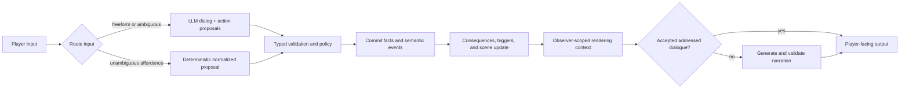

# Freytag Forge V2 product reference

> V2 cutover complete. The hosted `storygame.web_demo` adapter is the sole
> player-facing application surface and `RuntimeState` is the only mutable
> runtime authority. The retained `data/` directory is immutable authored
> input, not runtime state.

> The LLM-first runtime has a pinned rollback target, a testable
> root/`/dev/` channel contract, and isolated delivery channels. Successful
> trusted `main` CI deploys only to `/dev/` and Railway staging; production is a
> manual promotion of a previously staged immutable SHA. Phases 2–3 add
> isolated, versioned V2 `CompiledStory` inputs and a tested in-process runtime.
> The V2 mystery fixture is a data-only port of the authored Vale Mansion case,
> while V1 remains the deployed fallback pending V2 staging promotion and
> observation. See the
> [refactor plan](../.plans/gpt-refactor.md),
> [release baseline](release-baseline.md), and
> [acceptance matrix](v2-acceptance-matrix.md).

## Product Intent
Freytag Forge is a deterministic narrative-engine platform for interactive fiction. It aims to blend strong IF usability with modern, testable narration controls and reproducible evaluation.
Current runtime generation is package-driven.

## V1 porting Phase 1: opening and cast continuity

Opening orientation is a typed authoring projection, not freeform runtime
truth. `StoryOutline` normalizes protagonist context, opening companions,
public briefing, arrival context, scene purpose, and first available actions.
The compiler emits `CompiledStory.opening` as `OpeningMetadata`; each
`OpeningContact` carries identity, role, relationship, opening location,
public knowledge, and item custody. Local validation requires contacts to be
declared in the cast and present at the initial location, and rejects protected
revelation summaries in public opening text.

Bootstrap copies the accepted opening declarations into the runtime's opening
fact projection before any player-facing output. The hosted session response
projects the same typed metadata, and the frontend renders it without issuing
an automatic `look` turn. Ordinary turns remain proposal-first and the
opening projection cannot mutate state or bypass commit validation. Existing
reviewed causal artifacts remain loadable: the compiler supplies safe generic
defaults when legacy opening metadata is absent.

## V2 capability baseline

The engine is V2-only. The following behavioral requirements define the
cross-genre runtime baseline; they do not depend on a retained V1 migration
ledger or historical implementation artifacts.

The presentation target is progressive description. A newly entered room or
newly encountered item may receive a full authored description with atmosphere,
layout, visible details, and actionable context. Ordinary movement back into a
known room should be concise and should mention only changed or newly relevant
details. An explicit `LOOK` request may expand the room description again. Item
inspection follows the same rule. Observation/discovery markers are fact-backed
state; prose is a projection and may not create facts.

The NPC target is continuity, not decorative text. A declared NPC must remain
addressable only when present, answer as that NPC from permitted knowledge, and
retain interaction history, relationship state, and bounded stance changes.
Repeated questions may make an NPC impatient or less helpful, like a person,
but this is a generic validated interaction policy rather than a named-character
branch. Historical examples such as Daria inform the interaction shape only;
they are not V2 content. Current story packages provide their own NPCs.

Progression should be conversation-led and exploration-rich for every outline.
A question, earned trust, contradiction, follow-up, or purposeful investigation
of a place can unlock a declared lead or change the active objective. Searching
rooms and inspecting items remain valid player choices, but the experience must
not collapse into collecting interchangeable object text or solving detached
puzzles by rote. Objects and puzzles are optional authored supports;
conversation disclosures, exploration consequences, and relationship effects
are proposal-first, locally validated, and committed as facts before the
resulting lead or prose is shown.

These capabilities apply across mystery, fantasy, sci-fi, and relationship
stories. Opening metadata, room/item declarations, NPC roles, knowledge, and
presentation detail are authored inputs; accepted visibility, discovery,
dialogue effects, and relationship changes are committed to `RuntimeState`
facts before rendering.

## Causal compiler Phase 0: symbol-resolution baseline

The offline causal compiler now carries a checked-in Phase 0 characterization
corpus at `tests/fixtures/causal_compiler_phase0.json` and a versioned baseline
at `data/story_blueprints/diagnostics/phase0-baseline.json`. The corpus covers
truth, participant, location, connected-route, causal-event,
evidence-opportunity, realization-route, revelation, required-outcome, and
required-beat namespaces. It includes known references, wrong-namespace
references, ambiguous IDs, and candidates containing multiple reference
failures, with mystery, fantasy, sci-fi, and relationship coverage.

Phase 0 is intentionally characterization-only. It does not add a runtime
authority, mutate an artifact, or call a provider. The current compiler
contract is recorded explicitly: syntax errors precede binding errors;
`UNKNOWN_REFERENCE` remains the compatibility code for an unbound reference;
`AMBIGUOUS_REFERENCE` is reserved for the symbol-resolution migration; and
independent bindable failures are reported in deterministic source-collection
and field-declaration order. A rejected candidate keeps the existing bounded
repair behavior: one initial request plus one repair request, never more than
two inference requests.

The baseline is evidence for the Phase 1 registry and bound-IR work. It is not
a promotion artifact and cannot become runtime input. Future diagnostic-code
changes must update the compatibility record and the characterization tests in
the same change.

## Offline storylet compiler Phase 0: dramatic characterization baseline

The offline storylet compiler has a separate, non-runtime Phase 0 corpus at
`tests/fixtures/storylet_compiler_phase0.json`, a measured baseline at
`data/story_blueprints/diagnostics/storylet-compiler-phase0-baseline.json`, and
an author-owned Vale Mansion source Brief at
`data/story_briefs/vale_mansion_storylet.yaml`. The Brief is selected only for
future offline authoring work; the existing reviewed `vale_mansion_rebuild`
fixture remains immutable runtime input.

The corpus establishes the Phase 1 vocabulary across mystery, fantasy, sci-fi,
and relationship stories: multiple eligible dramatic situations, a free-form
action outside those situations, protected knowledge, a failure-forward
alternative, and a fact-shaped completion marker that will later prevent
repetition. It also records measurable acceptance criteria: applicable required
beats need two distinct advancement paths; completion must support distinct
route families; protected facts must stay out of player-visible context; a
completed storylet must become ineligible; and normal turns must retain the
one-request path with at most one bounded recovery request.

The baseline exercises the current reviewed fixtures and records deterministic
runtime-context token estimates, one provider request for each successful normal
turn, a two-turn material-progress rate, active-beat persistence without a
declared completion tag, and short narrative observations. The observations are
diagnostics, not golden prose assertions. This phase adds no Storylet contract,
selector, provider call, mutable quality store, or runtime authority; facts
remain the sole canonical mutable truth.

## Offline storylet compiler Phase 1: immutable contracts

`story-blueprint-v2` now optionally carries a `dramatic_spine`, named
fact-template `consequences`, and immutable `storylets`. A storylet binds to a
required beat, truth/participant/location/pressure availability, route family,
bounded realization modes, declared consequences, fact-backed
activation/completion/abort markers, and explicit failure-forward targets.
These are reviewed authoring data—not runtime authority or executable effects.

The shared symbol registry binds every new reference and rejects wrong
namespaces. Local validation rejects unsatisfiable availability, undeclared or
conflicting fact effects, protected availability facts, invalid completion
markers, and failure-forward cycles. Versioned genre profiles hold generic
storylet variety, pressure-span, and alternate-progression minima; shared code
does not inspect genre names. Candidate audits now project coverage by beat,
purpose, realization mode, route family, and failure-forward chain.

Genre-blueprint authoring has completed its offline-only Phases 1–2 contract
and profile-validation layer.
Raw outlines, `WorldPackage`, legacy `StoryPackage`, `CompiledStory`, and the
immutable Story Blueprint are authoring inputs or projections; canonical facts
are the only mutable truth during a session. `StoryBlueprint` locally validates
generic causal references, protected-fact release order, revelation graphs,
route reachability, optional beat intent, and viable endings for all supported
genres. Versioned, injected genre profiles add semantic causal roles, allowed
revelation/evidence routes, phase and turning-point requirements, and ending
requirements for mystery, fantasy, sci-fi, and relationship stories; no shared
runtime code branches on these genre names. It does not yet alter runtime
bootstrap or gameplay. A one-way reduced
projection keeps the public `CompiledStory` fixture API available while future
consumers migrate. See [genre-blueprint authoring](genre-blueprint-authoring.md).

Phase 3 adds the offline-only blueprint compilation and review workflow.
`BlueprintCompiler` requests provider JSON-object mode through an explicit
transport option, retries at most once without that option, locally validates
the complete generic/profile contract and source-outline provenance, then runs
injected whole-blueprint critics and the route-fairness specialist. One bounded
repair may be revalidated and re-reviewed. The resulting candidate envelope
records prompt/version, model metadata, source hash, diagnostics, reviews, and
repair status; it is not a runtime input or mutable authority. The
`storygame-blueprint` command is explicitly live-opt-in and never overwrites a
reviewed fixture.

Phase 4 adds an editor-reviewed Vale Mansion vertical slice at
`data/story_blueprints/v1/vale_mansion_case.yaml`. The offline artifact
declares the complete solution, initial party knowledge, bounded timeline,
evidence custody, location classes, alternate routes, and protected release
order. Its acceptance contracts prove two evidence-backed solution paths and
reject early unsupported completion. It remains an immutable authoring input;
Phase 5 realizes it into a fact-backed progression map at V2 bootstrap. A
turn can propose only a declared `route_id` with optional `evidence_ids`; local
progression policy validates current route availability and revelation/evidence
conditions before atomically committing facts. Bare completion tags are
rejected for blueprint-backed sessions, and the prompt receives only
observer-earned facts and legal route metadata.

Grounded-turn-contract Phases 0–4 have audited the V1 and V2
proposal/rendering boundaries, recorded the adapter-wide provider-call and
in-process latency baseline, and closed the generic material-staging path.
Ordinary V1 freeform turns carry typed `staging_claims`, checked only against
candidate facts after validated effects. Story packages declare fact-backed
environment transitions, bounded dramatic consequence classes, route blocks,
and evidence recoveries; validation rejects an unwinnable fully blocked route.
The planner receives only observer-scoped claim/effect choices, distinguishes
atmosphere from material staging, and renderers receive prose only after the
atomic commit accepts it. The same contract is exercised by mystery, fantasy,
sci-fi, and relationship sessions without a runtime genre branch. Accepted
planner turns project locally generated request IDs, retries, latency,
rejection codes, and outcome into committed event metadata, integrity-checked
save traces, and hosted-demo response headers; exhausted failures stay
uncommitted. See the
[grounded turn-contract baseline](grounded-turn-contract-baseline.md).

## V1 porting Phase 2: fact authority, inventory, clues, and documents

`storygame.runtime.facts` provides the minimal canonical fact layer beneath
`RuntimeState`. A frozen `Fact` is an assertable or retractable predicate with
typed subject, object, and optional value; `FactStore` owns the mutable set and
provides deterministic matching and JSON serialization. Supported policy
families cover identity, role, location, presence, custody, possession,
knowledge/unknown boundaries, discovered clues and leads, active goals/tasks,
scene objectives, relationships, NPC availability, item affordances, and flags.

Bootstrap derives these facts from compiled-story opening metadata, item
definitions, and the initial world declaration. `world.items`, inventory,
flags, location, and discovery attributes remain compatibility projections;
they are synchronized only while a cloned candidate passes
`validate_and_commit`.

Fact writes use the typed `StateOperation` boundary with `facts: add/remove`
operations. Custody is cardinality-one per item, and a transfer to the player
is legal only when the current holder is in the scene. Unknown items,
unsupported fact families, malformed facts, and unavailable items fail closed
without changing the prior state. The same fact set is serialized in the
versioned integrity-checked SQLite snapshot and restored on load.

Readable documents are declared through `ItemDefinition` and
`ReadableDocument`. A `DocumentDisclosure` names the document, addressed
speaker, and one declared fact. Runtime validation requires the speaker to be
present, permitted for that document/fact, and to know the fact; the player's
knowledge fact is committed before the response is rendered. Already-known
facts, wrong speakers, unavailable speakers, and non-readable items are
rejected. No package lookup or narration text can create a clue or disclosure.

## V1 porting Phase 3: dialogue and freeform action parity

`DialogueProposal` is the typed runtime boundary for NPC speech. It carries an
addressed `target_id`, matching `speaker_id`, a bounded list of permitted fact
ids, player-visible dialogue, and bounded `StateOperation` effects. Validation
requires the target to be present in the current scene and explicitly named or
otherwise unambiguously addressed by the player. The speaker must match the
target and possess every permitted fact. Prompt parroting and narrator-style
speaker substitution are rejected with typed fail-closed errors.

Dialogue effects are applied to a cloned candidate through the same atomic
fact/compatibility-view commit path as ordinary turns. Only after that commit
does the engine project the NPC's dialogue as the response. Protected
revelations are checked against both narration and dialogue, so spoken prose
cannot become an alternate knowledge authority.

Ordinary freeform play remains model-interpreted. The runtime only normalizes
unambiguous declared movement and visible-item affordances such as inspect and
take; those normalized intents still become bounded state operations and pass
local validation. It does not replace story interpretation with a fixed action
table. Ambiguous or unavailable targets/items remain model proposals and are
validated or rejected at the same boundary. The normal turn still permits one
provider request plus one bounded recovery request.

## V1 porting Phase 4: goals, dramatic state, and progression

`CompiledStory` carries generic progression metadata: `goals`, `tasks`,
`clues`, `scene_purpose`, `dramatic_question`, `initial_pressure`,
`relationships`, `timed_events`, and `endings`. These are immutable reviewed
authoring inputs. Cross-reference validation rejects tasks without a declared
goal, endings with unknown beats, and duplicate timed-event IDs.

Bootstrap realizes the declarations into `RuntimeState.facts`: goals and task
status, clue declarations, relationship assertions, scene purpose, dramatic
question, and scene pressure. The context builder projects declarations beside
current fact-backed pressure so the model can frame choices without gaining a
mutation authority. Beat order and pacing remain advisory projections over
facts, not a competing progression store.

At the atomic commit boundary, due timed events assert their declared facts,
record an `event_fired` fact, and apply bounded pressure changes. Each event
fires once, and all event effects are discarded with the candidate if the turn
is rejected. Ending declarations describe valid and failure-forward outcomes;
they do not force a player action or fabricate completion.

The Phase 4 contract is exercised across mystery, fantasy, sci-fi, and
relationship fixtures with the same runtime policy families and no genre branch.

## V1 porting Phase 5: persistence, artifacts, and replay

Runtime snapshots use the `runtime-state-v3` schema. The SQLite adapter stores
the compiled-story identity and hash beside a canonical JSON snapshot and its
SHA-256. The snapshot carries its own schema marker; unsupported versions,
invalid JSON, malformed payloads, story mismatches, and hash failures are
typed `RuntimeSaveError` failures before any state is rehydrated. A snapshot is
therefore a restart input, never a competing authority.

`storygame.persistence.story_state` provides the artifact projection boundary.
`artifact_bundle(state)` derives `StoryState.json`, `STORY.md`, `trace.json`,
and `transcript.json` from the current facts and accepted `RuntimeEvent`
decisions. It does not load a projection to reconstruct state. The JSON state
projection includes the fact set, accepted decisions, turn index, and a
compiled-story identity; the Markdown summary is a presentation projection;
trace and transcript data retain deterministic decision and narration evidence.

Every projection is covered by a versioned `manifest.json` containing stable
SHA-256 hashes. `verify_artifact_manifest` rejects missing or changed files,
and `verify_replay_signature` rejects replay evidence whose accepted decisions
have changed. `write_artifacts` uses temporary files followed by replacement,
so an orchestrator can regenerate a complete artifact directory after a
restart. The optional hosted-adapter `artifact_root` writes one projection
directory per session after bootstrap and each accepted turn; runtime requests
never consult those files for decisions.

Phase 5 regression coverage proves fact and event projection parity, artifact
corruption rejection, deterministic manifests, replay signatures, and the
existing hosted process-restart/load path. The runtime remains the sole
mutable authority; artifacts are integrity-checked evidence and projections.

## V1 porting Phase 6: hosted adapter and release parity

`storygame.web_demo` is the only player-facing application surface. The
authoring CLI remains offline-only, and no V1 runtime or rollback route is
reachable from the hosted adapter. The hosted contract is deliberately small:
`GET /api/v1/health` reports `status`, `runtime`, `channel`, and immutable
`sha`; `GET /api/v1/version` reports `api: v1` plus the same runtime/channel/SHA
identity; `POST /api/v1/session`, `POST /api/v1/session/load`, and
`POST /api/v1/turn` carry the typed session, state, narration, and fail-closed
runtime responses.

The static Pages client checks the version contract before opening a session,
uses the channel-specific API origin, and shows a non-production badge only for
staging/development bundles. The API and Pages bundles are independently
stamped with the same tested SHA; staging rejects identity mismatches before
publishing its deployment status. Production is a manual, protected-environment
promotion of a successful staged SHA, with isolated Railway namespaces and a
post-promotion hosted smoke test. The root Pages channel is production and
`/dev/` is staging; deployment assembly preserves the opposite channel rather
than replacing it.

Phase 6 release evidence is operational rather than a new runtime authority:
the staging evaluation artifact, deployment status, Pages `deployment.json`,
health/version responses, and production promotion record document the release
without becoming inputs to gameplay.

## Goals
- Deliver a playable hosted web IF experience.
- Keep world-state progression deterministic and replayable.
- Let LLMs drive ordinary in-scope story progression, NPC dialogue, and turn framing inside deterministic safety rails.
- Improve narration quality via bounded, reproducible coherence workflows.
- Persist canonical artifacts with traceability and integrity enforcement.
- Enforce explicit typed contracts at agent boundaries.

## Project Layout
```text
.
├── storygame/
│   ├── web_demo.py
│   ├── engine/
│   ├── llm/
│   ├── persistence/
│   ├── plot/
│   └── memory.py
├── frontend/
├── tests/
├── .plans/
├── .github/workflows/
├── runs/
├── Makefile
├── pyproject.toml
└── README.md
```

## Tool Stack
- Language/runtime: Python 3.12
- Package/runtime tooling: `uv`
- Web/API: FastAPI + Uvicorn
- Testing: pytest + pytest-cov
- Linting/format rules: Ruff
- Persistence: SQLite (save snapshots + vector memory)

## Architecture Overview

### V2 standalone runtime (Phase 3)

`storygame.runtime` is independent of V1 facts, predicate policies, parser
execution, plot selection, and packages. A compiled story bootstraps one
`RuntimeState` containing world state, per-beat runtime data, turn index,
recent events, and rolling summary. It is the sole mutable authority.

Each `RuntimeEngine.turn` builds a bounded context from that state, calls an
injected turn model in explicit JSON-object mode, locally parses a `TurnResult`,
validates a cloned state, then atomically replaces the state only on success.
JSON-mode rejection, malformed output, schema failure, and model errors share
one recovery budget: at most two inference requests. Failed recovery returns a
typed error and retains the prior state unchanged. Narration is never an input
to mutation.

The minimal validator permits only schema-defined set/add/remove operations,
enforces unique item custody, protected-revelation boundaries, monotonic beat
completion and prerequisite order. `PacingController` supplies advisory
`open`, `nudge`, `advance`, `escalate`, and `force_consequence` directives;
even the hard limit does not prescribe the player action. Runtime events carry
the prompt version and token estimate for traces.

### Design Delta: LLM-Driven Runtime Within Deterministic Guardrails
- Ordinary gameplay turns are story-first, not parser-first.
- Deterministic systems remain the sole authority for:
  - NPC initial locations,
  - NPC stable traits,
  - timed story events,
  - player characteristics,
  - item locations and item characteristics,
  - map topology and room characteristics,
  - story goals,
  - puzzles,
  - clues,
  - world-state commits,
  - world-state mutations through the fact store,
  - fact validation,
  - inventory/location legality,
  - map reachability,
  - persistence,
  - replay signatures,
  - bounded acceptance/rejection of LLM proposals.
- The LLM is the default author of:
  - opening prose,
  - turn narration,
  - NPC dialogue,
  - immediate turn framing,
  - in-scope action interpretation,
  - story presentation around deterministic facts,
  - candidate story consequences,
  - candidate beat/event suggestions.
- The engine must not reduce ordinary turns to a small parser command set unless:
  - the player used an explicit control-plane command,
  - the LLM proposal is invalid,
  - the proposal fails deterministic validators,
  - or the requested action cannot be mapped into a bounded deterministic commit.
- The player must be allowed to attempt any action or story move. Nothing is off limits at the gameplay layer; the system should adapt the story and fact state to the player prompt whenever a bounded commit is still possible.
- Non-addressed world interactions should remain scene-scoped by default. The runtime must not auto-target the nearest visible NPC or force an NPC-reply contract for player actions aimed at the environment, visible items, vehicles, exits, or room features unless the player clearly addressed or questioned that NPC.
- Goal-breaking actions are handled by explicit confirmation only when the requested prompt would break the current story goals beyond repair:
  - engine explains why the action would rupture the current story-goal structure,
  - player chooses `PROCEED` or `CANCEL`,
  - this confirmation interruption must happen before the official LLM-authored response to the original prompt,
  - confirmed `PROCEED` triggers deterministic state markers plus story replanning of NPC behavior, likely consequences, and event timing,
  - only player-confirmed major disruptions may change core story goals,
  - lighter confirmed disruptions should adapt around the current goal rather than rewriting it,
  - after `PROCEED`, the game should generate the official LLM-authored response to that same original prompt under the updated fact state.
- Product intent for runtime feel:
  - the game should feel like a responsive story simulation with deterministic enforcement,
  - not a classic command parser with LLM text layered on top.
- For direct-address conversation with a visible NPC, accepted freeform proposals must surface that NPC as the dialogue speaker. Player-speech echoes and narrator summaries are invalid substitutes for the NPC reply and should fail closed.
- For direct-address conversation with a visible NPC, the accepted dialogue speaker must match the addressed NPC target (assistant aliases may resolve to that target), and in-character dialogue must not leak code or implementation artifacts into story text.
- A direct question about a readable document may disclose one package-declared,
  still-unknown fact only when the addressed NPC is on scene and knows that
  fact. The typed action proposal carries the selected disclosure key; policy
  commits `knows(player, key)` before the NPC reply is rendered. A selected key
  for another document, an unavailable speaker, or already-known player fact
  is rejected without a new commit.
- Authoring validation requires every `readable.npc_disclosures` entry to name
  a readable-document fact, a canonical package `case_fact`, an existing NPC
  who knows it, and a fact absent from the opening public briefing. The schema
  is genre-neutral; the mystery case file and fantasy warded scroll are
  declarative examples rather than runtime exceptions.

### Core Engine
- `storygame.engine` handles control-plane parsing, deterministic-affordance normalization, world rules, state transitions, and event emission.
- Turn routing is proposal-first at the commit boundary. Freeform or ambiguous gameplay uses an LLM proposal; unambiguous visible affordances (`look`, inventory, take, use, and movement) may be normalized deterministically into that same proposal/commit contract without a provider request.
- Deterministic parser commands directly handle only explicit slash-prefixed control input (`/save`, `/load`, `/quit`, `/help`). Ordinary words are always story input, not parser commands.
- Inventory remains a deterministic affordance within the story-first runtime surface. Map movement resolves a named destination or unambiguous in-world route description through the shared proposal/commit contract. The world graph uses semantic route labels; compass directions are neither commands nor narration context.
- Runtime world truth is fact-based (`at`, `holding`, `path`, `locked`, `flag`, `story_goal`, `active_goal`, `assistant_name`, `npc_role`, `npc_relationship`, `discovered_clue`, `discovered_lead`, etc.) with legacy object views synchronized for compatibility.
- Canonical fact mutation goes through a validated commit boundary that normalizes uniqueness-sensitive writes, enforces runtime invariants, and refreshes compatibility projections after commit.
- Fact-store authority must cover goals, clues, puzzle state, NPC locations, NPC relationships, discovered leads, event flags, reveal state, and item possession/location as assertable/retractable facts.
- Story-specific facts such as identities, timelines, motives, clues, revelation threads, and planned events must be seeded into and read back from fact-backed state rather than queried from transient package payloads.
- Scene and dramatic runtime state are now also fact-backed during transition (`current_scene`, `scene_location`, `scene_objective`, `dramatic_question`, `scene_pressure`, `beat_phase`, `beat_role`, `player_approach`, `scene_participant`).
- `storygame.llm.context.build_narration_context` should read scene/dramatic facts first and treat `progress`/`tension` as compatibility inputs when those facts are absent.
- `storygame.plot.dramatic_policy` is the compatibility policy layer that derives approach/question/role from parser turns, structured proposals, and freeform conversational turns before beat selection runs.
- `storygame.engine.world_builder` selects outline + curve + map/entities/items metadata (`world_package`) by genre/tone/session.
- `storygame.story_packages` is the offline authoring/evaluation boundary. It
  validates generated story-package schema, reachability, revelation paths,
  character availability, causality, role contracts, and ending viability before
  any package can be realized into the fact-backed runtime.
- `storygame.authoring` is the separate V2 authoring boundary. Its immutable
  `CompiledStory` contract declares characters, protected revelations,
  completion tags, Freytag beats, dependencies, and pacing. It is locally
  validated before use and must not import or reuse V1 fact/proposal contracts.
  Checked-in fixtures live under `data/compiled_stories/v1/`; model compilation
  is explicitly opt-in through `FREYTAG_ENABLE_LIVE_COMPILER=1`.
- `storygame.engine.bootstrap` validates LLM-expanded outline bootstrap plans before runtime state is realized.
- `storygame.engine.world` realizes that package into playable runtime `WorldState` at startup.
- `storygame.engine.world` also supports bootstrap-plan realization for sessions that start from a simple author outline expanded into structured characters, items, goals, and trigger specs.
- Plot progression is controlled by Freytag phase/tension modules under `storygame.plot`.
- `storygame.engine.incidents` realizes abstract beats into concrete in-world incidents with deterministic trigger logic.
- `storygame.engine.semantic_actions` applies typed, already-validated direct effects as canonical events plus fact-backed mutations; it is not a parser authoring route.
- `storygame.engine.triggers` evaluates unified action-trigger and turn-trigger specs against committed semantic events and canonical facts.
- `storygame.engine.turn_runtime` is the default proposal-first path for structured turn proposals, deterministic commits, and follow-up trigger execution.
- `storygame.engine.consequences` runs the validated deterministic post-direct-effect rule pass before triggers.
- `storygame.engine.affordances` derives legal exits, locks, visible items, addressable NPCs, and inventory from canonical facts for model context.
- `storygame.engine.npc` owns typed fact-backed NPC role contracts, epistemic updates, adaptive traits, delegated-task lifecycle, and side-effect-free NPC action validation.
- `storygame.plot.beat_policy` owns deterministic Freytag beat legality and
  fact-driven reveal/timed-event scheduling. It consumes canonical phase, role,
  pressure, obstacle, conflict, reveal-budget, and NPC scene-goal facts; player
  actions remain open-ended and are validated by the turn policy.
- A dedicated turn-orchestration layer accepts structured candidate proposals from the LLM and commits only validated deltas to canonical world state.
- Deterministic engine actions are an adapter target for proposal execution, not the primary authored experience for ordinary narrative turns.

### Narration + Coherence
- `storygame.llm.adapters` defines the Cloudflare Workers AI narrator integration.
- `storygame.llm.context` constructs constrained narration context.
- `storygame.llm.coherence` currently provides bounded narration gating, scoring, telemetry, and recovery for non-dialogue rendering. The target fast path is deterministic committed-state validation with, at most, one bounded repair; multi-critic package review remains offline evaluation rather than a required ordinary-turn dependency.
- Offline package evaluation injects frontier generation and parallel continuity,
  causality, and dialogue-fit specialists. Its versioned weighted judge has
  critical floors; bounded recovery records fact categories and revalidates the
  complete candidate. This is not an ordinary-turn dependency.
- Multi-critic evaluation executes critic runs in parallel per round while preserving deterministic output ordering for judge inputs.
- Critics and judge inputs must include canonical opening facts so review can reject contradictions between opening text and turn-based text, especially role conflicts, duplicated clue locations, and impossible physical staging.
- `storygame.llm.story_director` orchestrates story-design LLM agents (architect/character/plot/narrator/editor).
- Opening/bootstrap orchestration should prefer a single story-bootstrap agent call that returns protagonist identity, assistant/contact plan, actionable objective, longer-term goals, reveal schedule, and player-facing opening paragraphs in one contract.
- Legacy multi-agent opening chains (architect -> character -> plot -> narrator) are compatibility/fallback paths only; they are not the preferred runtime path because they waste latency budget.
- Story/bootstrap planning should be cached into runtime state once and reused rather than recomputed from deterministic seeded goal text.
- Overall latency goal: keep all story-agent interactions under 10 seconds per turn, biasing toward fewer LLM round-trips over many narrow agent calls.
- `storygame.llm.story_agents.prompts` defines per-agent prompt templates.
- `storygame.llm.story_agents.contracts` defines per-agent JSON contracts and parsers.
- Story-agent parsers enforce required JSON keys but normalize lightweight label/punctuation variants and ignore non-contract extra fields to reduce brittle generation failures.
- `storygame.llm.contracts` defines and validates strict typed contracts:
  - `AgentProposal`
  - `StoryPatch`
  - `CritiqueReport`
  - `JudgeDecision`
  - `RevisionDirective`
- `TurnProposal` is the structured execution contract for semantic actions, bounded state deltas, narration claims, dialogue, and beat hints.
- Current LLM freeform planning first validates paired `DialogProposal` and `ActionProposal` payloads, then resolves them through the same policy and commit boundary. Deterministic affordances likewise construct a `TurnProposal` after normalization. Slash-prefixed control-plane commands stay outside semantic turn execution.
- Application orchestration and runtime execution should preserve typed contract boundaries instead of widening accepted `TurnProposal`, `JudgeDecision`, `CoherenceTelemetry`, or `ImpactAssessment` payloads into ad-hoc dicts. When a payload crosses persistence or pending-confirmation storage, normalize it back into the explicit contract at that boundary before reuse.
- A valid runtime proposal may suggest:
  - dialogue,
  - room-facing narration,
  - NPC reactions,
  - event candidates,
  - bounded fact mutations,
  - bounded numeric deltas,
  - and beat advancement hints.
- Deterministic validation decides which parts are committed, revised, or rejected before the player-facing turn is finalized.
- Phase 2 predicate policies validate proposal deltas by family (world,
  perception, knowledge, relationships, tasks, traces, or dramatic), source,
  arity, normalization, and invariant contract before commit.
- Intent-effect families cover movement, examination, communication,
  manipulation, transfer, concealment, assistance, opposition, and waiting;
  unique visible aliases are resolved at the boundary and ambiguous aliases
  produce clarification rather than a guess.
- Post-direct-effect consequences use one validated rule-pack schema across
  physical/environmental, access, social, investigative, and technical state;
  universal rules are separate from optional genre extensions.
- Phase 3 perception is observer-aware: `ObservationResolver` separates
  existence, location, accessibility, perceptibility, observation,
  recognition, and interpretation. `observer_context_slice` and
  `speaker_context_slice` prevent hidden case truth and unrelated scene facts
  from entering player or NPC prompts.
- Core policy data declares concealment/exposure, lighting, weather, sensory
  blocking, portals, traces, discovery, evidence state, and contamination.
  Evidence movement remains subject to custody cardinality, while state
  transformations replace the prior evidence state deterministically.
- Phase 5 NPC state is explicit: `knows`, `believes`, `suspects`, `conceals`,
  and `may_infer` facts are observer-scoped; role capabilities and obligations
  gate NPC actions; stable traits are separate from bounded adaptive traits;
  and delegated work transitions through a validated durable task lifecycle.


```mermaid
flowchart LR
    I[Player input] --> R{Route input}
    R -->|freeform or ambiguous| L[LLM dialog + action proposals]
    R -->|unambiguous affordance| A[Deterministic normalized proposal]
    L --> V[Typed validation and policy]
    A --> V
    V --> C[Commit facts and semantic events]
    C --> T[Consequences, triggers, and scene update]
    T --> X[Observer-scoped rendering context]
    X --> D{Accepted addressed dialogue?}
    D -->|yes| O[Render committed NPC dialogue]
    D -->|no| N[Generate and validate narration]
    N --> O[Player-facing output]
```

### Persistence + Canonical Artifacts
- `storygame.persistence.savegame_sqlite` stores run snapshots/events/transcripts.
- Save/load must preserve the fact-backed active goal and restore it back into canonical runtime facts on load.
- `storygame.persistence.story_state` emits canonical turn artifacts:
  - `StoryState.json`
  - `STORY.md`
- Artifact payloads and markdown should report the fact-backed active goal rather than stale in-memory fallback fields.
- Artifact integrity is enforced by hash checks and orchestrator-only write constraints.
- Each artifact trace includes `parent_story_state_sha256` to link canonical snapshots across persisted turns.
- Per-turn artifact history is retained under `story_artifacts/<slot>/turns/<turn_index>/`.

### Web Surfaces
- `storygame.web_demo` is the sole application surface:
  - `GET /api/v1/health`
  - `GET /api/v1/version`
  - `POST /api/v1/session`
  - `POST /api/v1/turn`
- Hosted demo is a separate deployment surface with different narrator/backend assumptions:
  - turn narration is driven through the Cloudflare Workers AI path,
  - hosted bootstrap/opening uses the same Cloudflare Worker credentials,
  - hosted bootstrap/opening uses direct LLM-authored scene prose through that backend,
  - when the hosted backend cannot satisfy the story-bootstrap JSON contract, hosted demo bootstrap should fall back to a prose opening path over that same backend rather than failing the whole opening on contract shape alone,
  - hosted demo opening should use a single-bootstrap-call fast path, with deterministic validation on the first-response critical path and bootstrap-critic, output-editor, and remote room-presentation passes kept out of that latency-sensitive path,
  - and hosted failures must fail closed with typed client responses rather than surfacing backend configuration exceptions.
- `frontend/` is a minimal static GitHub Pages client for the hosted demo API. It creates a session, auto-runs `look`, and sends subsequent commands to the Railway-hosted `web_demo` backend via `VITE_API_BASE_URL`.
- Hosted-demo sessions use explicit TTL expiry with server-side `session_id` continuity.
- Demo app save/load slots are scoped by `session_id` for deterministic isolation.
- Demo app enforces guardrails:
  - per-IP short-window rate limit,
  - per-IP daily turn cap,
  - per-session turn cap.
- Demo app supports browser-based hosted clients through configurable CORS origin allowlisting.
- Cloudflare demo narrator env inputs (`CLOUDFLARE_WORKER_URL`, `CLOUDFLARE_WORKER_TOKEN`, `CLOUDFLARE_TIMEOUT`) are normalized at adapter boundaries to avoid whitespace-driven deploy breakage.
- Cloudflare demo narrator requests use bounded retries for transient upstream failures (network errors and HTTP 5xx), while still failing fast on hard errors like 403/429.
- Demo `/api/v1/turn` now returns typed fail-closed statuses for hosted clients:
  - `rate_limited` (HTTP 429),
  - `quota_exhausted` (HTTP 429),
  - `service_unavailable` (HTTP 503),
  - `ok` (HTTP 200).
- Hosted demo fail-closed narrator responses are also logged server-side with the underlying upstream error string for operator diagnosis while preserving generic client-facing error payloads.
- GitHub Pages deployment is handled by `.github/workflows/deploy-frontend-pages.yml`, using a Pages repo variable `VITE_API_BASE_URL` to point the static client at the Railway backend.

## Feature Details
### Beat Realization
- Abstract Freytag beats are realized as concrete incidents (for example: panic spikes, interrupted briefings, forged directives).
- Incident triggers are deterministic and may depend on:
  - turn timing (`min_turn`),
  - player location,
  - inventory requirements,
  - recent action-event patterns (for example specific `talk`/`take` activity).
- Incidents are one-shot via explicit per-incident flags and can adjust progress/tension.
- Incident definitions are authored in `storygame/content/incidents.yaml`.
- Trigger schema supports boolean groups (`all`/`any`/`not`), `cooldown_turns`, and ordered event `sequence` matching.
- If no incident matches the current beat context, the engine falls back to generic beat-tagged plot templates.

### World Builder Interfaces
- Runtime map/entity/item realization is derived from `world_package` (selected from outline + curve templates) rather than static scene constants.
- Deterministic world packages may still seed map/entity/item topology, but seeded setup objectives, default primary objectives, public-setting paragraphs, and story-plan prose are no longer authoritative runtime content.
- Runtime goals, reveal threads, protagonist identity, assistant identity, timed story events, and opening prose should come from the LLM bootstrap contract and be persisted back into canonical fact-backed runtime state for later deterministic validation/replay.
- Bootstrap establishes a package-defined protagonist identity in canonical facts; shared runtime behavior does not assume a fixed protagonist, gender, or genre.
- Accepted bootstrap outputs should also establish canonical assistant/contact relationship facts, villain facts, clue-placement facts, and timed-event participant facts.
- Accepted bootstrap outputs must also establish canonical role exclusivity and clue custody/location facts for the opening scene so later narration can validate who is the assistant, who is a suspect, and where each clue physically is.
- Narration, including opening prose, must read from canonical facts and present those facts diegetically rather than inventing a parallel story state outside the fact store.
- Predicate and rule packs are YAML-defined:
  - `data/predicates/core.yaml`
  - `data/predicates/genres/<genre>.yaml`
  - `data/rules/core_rules.yaml`
  - `data/rules/genres/<genre>_rules.yaml`
- NPC voice cards are defined in `data/npc_voice_cards.yaml`.
- NPC identity, pronouns, voice, roles, and relationships are validated package data; shared runtime code must not infer them from names or genre assumptions.
- Runtime contract validators cover:
  - `ActionProposal`
  - `DialogProposal`
  - `StateUpdateEnvelope`
- Gameplay intent resolution uses an LLM-first simulation path:
  - Freeform and ambiguous ordinary gameplay inputs use the LLM proposal adapter.
  - Unambiguous visible affordances are normalized locally into a typed proposal and do not require a provider request.
  - Proposal outputs are interpreted as candidate story actions and candidate story consequences, not just parser aliases.
  - If a freeform input cannot obtain a valid LLM proposal, the turn fails closed rather than dropping into deterministic authored fallback.
- Ordinary prompts should be treated as adaptation opportunities, not scope violations. The runtime should prefer mutating canonical facts and replanning around the player’s actual input over refusing the action outright.
- Proposal routing resolves an explicitly addressed visible NPC against the scene cast and must not silently redirect dialogue to another nearby character.
- Runtime adapters produce dialogue, action, event, and state-delta proposals.
- Freeform turn planning may retry once when the model responds with non-JSON text, but ordinary gameplay must still fail closed if a valid typed proposal cannot be recovered.
- Engine policy maps proposals into bounded deterministic fact deltas before commit.
- Candidate visible changes are accepted only as typed proposal claims and bounded effects before commit. Planner context is observer-scoped and names only legal claim/effect choices; rendered prose comes only from a successful atomic commit and is never an extraction source or a mutation authority.
- In-scope proposals should usually yield meaningful world or relationship consequences rather than collapsing to generic flag-only bookkeeping.
- Unknown or weakly-specified intents should still be interpreted through proposal/policy contracts; if the runtime cannot author the turn through that path, it should fail closed instead of inventing deterministic substitute prose.
- Package-declared readable items and other unambiguous affordances resolve through generic intent policy and commit only their declared discovery, knowledge, or state effects.
- Opening setup seeds package-declared identities, relationships, goals, knowledge boundaries, item custody, and planned events into facts so dialogue and narration remain continuous without shared genre assumptions.
- Reading or inspecting a package-declared item surfaces its committed discoveries through player context rather than through untracked prose memory.
- Story-significant item inspection/acquisition should assert deterministic discovery facts (for example `discovered_clue` and `discovered_lead`) so later narration, story-status output, and continuity checks can rely on canonical discoveries instead of prose memory alone.
- Story-status and role projections should prefer fact-backed declared facts, discovered leads, hidden threads, and planned events over room heuristics or stored bootstrap query payloads.
- NPCs are stateful story actors:
  - their replies should usually be LLM-authored from deterministic context,
  - their knowledge, trust, availability, and goals remain deterministically tracked,
  - and their output must remain consistent with visible facts and prior reveals.
  - addressed NPC turns must prefer direct LLM-authored replies from that NPC rather than generic narrator paraphrase,
  - the runtime must not auto-target a nearby NPC for unrelated player actions,
  - and if the LLM path for an ordinary conversational turn is unavailable, the turn should fail closed rather than fabricating deterministic dialogue or narrator scaffolding.
- Item references resolve unique visible shorthand during deterministic validation; ambiguous aliases require clarification.

### Output Contract
- Non-debug mode keeps player-facing, diegetic output.
- Bootstrap output includes the opening and initial room presentation. Ordinary
  turns render generated narration or accepted addressed-NPC dialogue, except
  committed player movement: a first observed arrival renders that room's new
  presentation plus its current contents and exits, while later arrivals render
  only current contents and exits. Arrival history is fact-backed; inventory,
  goals, and repeated character introductions remain grounded context rather
  than a competing output channel.
- Room presentation uses plain title + prose layout (no bracketed room labels or event bullet prefixes) where a surface renders a room block.
- Once an NPC has been introduced, later dialogue speaker labels should shorten to first-name-only when unambiguous, including after output-editor review.
- Room presentation now uses cached long/short descriptions per location: `LOOK` renders long form; non-LOOK turns render short form.
- Story prompts enforce opening-scene guidance for turn 0 (3-4 paragraphs with who/where/immediate objective).
- Package openings use the protagonist identity established by that package's canonical bootstrap facts.
- Opening and goal language must preserve package-declared role continuity. A character may not hold incompatible roles unless an explicit, committed story transition establishes the change.
- Opening and early-turn text must agree on clue custody and placement. If a character is holding a clue item, the same clue must not also be described as lying in the environment or discovered elsewhere in the same scene.
- Opening fact staging must be coherent at the canonical-state level and must not be repaired through fallback world mutation. Bootstrap validation rejects conflicts between declared custody, location, exposure, and opening prose.
- Accepted opening text must be a projection of committed canonical facts. If opening prose conflicts with committed role, location, custody, or clue-staging facts, bootstrap/opening validation must fail closed instead of repairing runtime truth after the fact.
- Opening/bootstrap regression coverage should verify validator-oriented failures in varied categories rather than replaying a single named clue example. At minimum, tests should cover role continuity, NPC location continuity, item/clue custody continuity, and opening-to-fact parity across the hosted frontend and API.
- Opening scene paragraphs are rendered with blank-line separation in hosted client transcripts for readability.
- Opening prose should default to present tense. Mutable player knowledge must come from fact-backed state transitions, not increasingly specific prompt guardrails.
- Web turn responses now also preserve opening paragraph spacing with explicit blank-line separators.
- Web bootstrap response (`start`/`look` on a fresh run) returns opening scene text plus the initial room block.
- Hosted-demo bootstrap is an explicit compatibility boundary: it uses the same Cloudflare Worker contract as every other live surface.
- Opening prose should feel materially consistent across the hosted frontend and API: both surfaces use direct LLM-authored scene prose grounded in the same planned story context.
- First substantive command in a fresh web run no longer prepends opening text; it returns only the command echo + turn body.
- First substantive command parity should be shared across the hosted frontend and API at the story/output level.
- Opening intro combines protagonist name and background in one natural sentence (for example, `You are <name>, <background>.`) with punctuation normalization.
- Opening generation must remain LLM-authored. If bootstrap/opening generation fails, the surface should fail closed instead of fabricating deterministic opening prose.
- Opening prose is still LLM-authored, but it must be authored from deterministic fact-backed context rather than from an untracked side-plan that can diverge from world state.
- When opening/turn prose quality is weak, prefer enriching the fact-backed world context over adding bespoke deterministic cleanup rules. Deterministic validators/editors should be added only for resilient, high-signal failure classes that generalize well, not as an open-ended catalog of example-specific patches.
- Story prompts enforce spoiler discipline (later twists are withheld until revealed by progression/events).
- Revision directives reinforce turn sequencing priorities: room name, room description, items, exits, then NPC/background.
- A deterministic opening-scene story editor runs before display to remove legacy/meta phrasing and fix obvious narrative incoherence.
- The opening-scene story editor must make the full opening cohesive across bootstrap paragraphs and the first turn-facing text, reconciling role labels, clue ownership, physical placement, and other scene facts into one consistent version before anything is shown to the player.
- Opening prompts should treat canonical room description, exits, visible NPCs, visible items, and inventory as primary grounding facts so implausible scene staging is prevented at generation time rather than patched with bespoke cleanup rules.
- Opening output contracts should reject or strip prompt/directive-shaped field dumps before display (for example `Room name: ... Room description: ... Items: ... Exits: ...`) so hidden instruction scaffolding cannot leak into the player-facing opening.
- Opening facts seed package-declared custody, scene fixtures, and availability before prose generation, so room text and prompts do not invent competing state.
- Rich fact grounding should flow through the shared turn-context pipeline, not only the opening path. Scene facts, NPC purpose/relationship facts, and visible item state/ownership facts should be reusable by opening prose, ordinary narration, and freeform NPC replies alike.
- LLM-facing prompt payloads should expose player-facing item labels and fact summaries rather than leaking internal item ids into visible-item text. Stable internal ids may still exist for deterministic commit boundaries, but prompt-visible scene description should use display labels.
- Story-bootstrap and opening prompts should receive canonical opening facts from the fact store, such as assistant role/purpose, visible item custody, and pending knowledge state. Prefer passing those facts directly over layering more prompt-only prohibitions about role continuity or clue custody.
- Deterministic room and turn presentation should read item custody/state facts generically across map locations rather than relying on room-specific hard-coded prose. If canonical facts say the player owns or drove a visible vehicle, room text should reflect that fact wherever the vehicle appears.
- Deterministic room-presentation summaries should remain complete clauses or sentences, not visibly truncated fragments with `...`, so movement into any room still reads like authored prose.
- Deterministic ambient event text should stay geographically compatible with current and adjacent map facts. If a line names a drive, street, lane, road, courtyard, or similar exterior source, that source should be justified by current-room facts, adjacent-room geography, or adjacent-room item state; otherwise the text should fall back to a generic outside reference.
- When turn quality is weak, prefer enriching reusable world facts and prompt grounding before adding bespoke deterministic validators. New deterministic guardrails should be reserved for resilient failure classes, not narrow patches for individual examples.
- Accepted targeted NPC dialogue should be allowed to introduce bounded new facts and commit them immediately; if the reply contradicts already-committed canonical facts such as the NPC's appearance, the turn should fail closed rather than display conflicting dialogue.
- Ordinary-turn rendering uses deterministic committed-state validation and at most one bounded model repair; critic/editor passes are offline or bounded-recovery tools, not a fast-path dependency.
- Validation and offline critic/judge review must treat incompatible roles, duplicated custody or location, and similarly impossible scene facts as blocking coherence failures rather than minor style issues.
- Turn output retains explicit LLM narration only when that narration is still the right player-facing surface; if downstream review strips a non-dialogue narration line, the original narration is reattached.
- Turn narration is action-grounded: if a generated narration omits meaningful tokens from the player’s command, a deterministic action-reference prefix is added.
- Per-turn rendering is hybrid: narrator output can replace deterministic room/event blocks for ordinary turns. Conversational turns should surface LLM-authored NPC dialogue when available; if the required LLM-authored dialogue cannot be produced, the turn should fail closed instead of substituting deterministic prose.
- Contract-invalid ordinary narration is rejected or repaired within the bounded rendering budget without exposing internal error strings to players.
- Legacy signal/resonance hint copy has been removed from normal room output.
- Turn intent routing is proposal-first for ordinary play: freeform inputs are LLM-authored, while deterministic affordances are normalized into the same runtime proposal contracts before deterministic validation and commit.
- Navigation supports named destinations and semantic movement phrasing at the proposal layer, resolving only when current-room and destination-room facts identify one unique legal exit.
- Deterministic parser paths are retained only for slash-prefixed control-plane commands; ordinary gameplay should not degrade into parser-authored fallback turns.
- NPC replies should be LLM-authored and context-rich. Normalization to explicit dialogue format remains allowed for clarity, but the runtime must fail closed rather than substituting deterministic NPC or narrator replies when ordinary conversational authorship is unavailable.
- Prompt-parroting dialogue should be rejected only for near-verbatim question restatements or player-echo phrasings, not for substantive answers that naturally reuse a few topic words from the player's question.
- A proposed NPC movement, transfer, or comparable visible change commits its typed fact operation before narration is rendered, so later turns read the same truth the player saw.
- Once an NPC has been introduced by full name, later room and dialogue rendering shortens to first-name-only when the first name is unambiguous in the current room.
- Active-goal copy is treated as opening/setup material by default; later turns suppress repeated objective phrasing unless the player explicitly asks about the goal/objective.
- Asking an assistant about the current goal/objective is handled as a first-class freeform topic and returns the current deterministic `active_goal`.
- Story-status, web/bootstrap state snapshots, persistence artifacts, and other player-facing objective displays should read the canonical fact-backed `active_goal`.
- Opening generation should prioritize character background, motivation, communication, and relationships. Repeating room or weather description already covered by the room block is only useful when it materially changes character intent, tension, or the immediate objective.
- Opening prompts should ask for full-name-first NPC introductions and should limit pure-surroundings exposition to what materially sharpens character pressure or the immediate objective.
- Policy-impossible freeform actions return constrained boundary responses with no state mutation.
- High-impact commands are detected generically (safety/legal/social/goal disruption) and require explicit `PROCEED`/`CANCEL` confirmation before mutation only when they would break current story goals beyond repair.
- Confirmed high-impact choices emit a `major_disruption` marker and replan context so story agents can adapt NPC behavior, object significance, event timing, likely consequences, and future room framing.
- Replan context includes whether the disruption is a light adaptation or a player-confirmed goal-change event.
- Goal-breaking confirmation must interrupt before the official response to the triggering prompt; after `PROCEED`, the system should answer that original prompt under the new fact state rather than substituting a different authored action.
- Transcript command echo uses `>COMMAND` format.
- Hosted transcripts insert a blank line before each `>COMMAND` echo for readability between turns.
- Hosted turn responses prepend `>COMMAND` each turn for transcript-style continuity in clients.
- Debug mode includes parseable structured trace via `[debug-json] ...`.
- Debug traces for runtime turns include proposal/policy diagnostics (proposal source/error, accepted vs rejected deltas, applied fact ops, event decisions, and story delta) to explain why and how state changed.

### Coherence Gate
- Critics: `continuity`, `causality`, `dialogue_fit`.
- Critic score payloads use explicit `ScoreVector` contract keys (`continuity`, `causality`, `dialogue_fit`) for static and runtime validation alignment.
- Judge: deterministic single arbiter with fixed weighted rubric.
- Threshold and critical floors are enforced deterministically.
- Hard limits: rounds, per-role tokens, wall-clock timeout.
- Retryable hard-fails use reversal seeding with preserved/modified/discarded delta reporting.

### Deterministic Validators
- Entity reachability
- Inventory/location consistency
- NPC presence consistency (off-screen NPCs cannot be narrated as present in-room)
- Committed-state contradiction checks
- Beat-transition legality
- Grounded material staging claims: a local candidate-state validator checks
  `custody`, `environment`, `access`, and `event` claims after bounded effects
  apply to a clone. Unknown, duplicate, contradictory, and off-scene claims
  consume the shared recovery budget and fail closed without a fact commit.
  Phrase matching is not a second custody authority.

### Evaluation Harness
- Fixed-seed regression tests for replay stability.
- Output contract tests for debug/non-debug boundaries.
- Contract parser tests for malformed payload rejection.
- Runtime-behavior tests for:
  - LLM-driven in-scope dialogue actually affecting deterministic state,
  - NPC consistency across turns,
  - validator rejection of contradictory LLM proposals,
  - high-impact confirmation + replan flow,
  - and proposal-first routing remaining the only ordinary-gameplay authored path.

## Implementation Guardrails
- `AGENTS.md` should be treated as an implementation guardrail document for this PRD, not just a coding-style note.
- Future implementation work should preserve these runtime invariants:
  - ordinary turns must remain LLM-proposal-first,
  - deterministic systems must remain commit authorities,
  - parser handling must remain limited to control-plane commands,
  - the player must be allowed to attempt any story move,
  - confirmation must occur only when the requested move would break current goals beyond repair,
  - that confirmation must occur before the official response to the original prompt,
  - and tests must lock these behaviors in before refactors land.
- If implementation begins drifting back toward parser-dominant turn handling, update `AGENTS.md` with explicit architecture rules or a required checklist for proposal-first routing and validation boundaries.

## Hosted runtime
- Public play is delivered through the GitHub Pages frontend and the hosted `storygame.web_demo` API.
- Deployment and hosted smoke tests are managed by the repository workflows; there is no local application mode.
## Environment Variables

Players do not configure environment variables. The hosted frontend and API
receive their deployment configuration through GitHub Pages and Railway.

### Offline authoring/compiler
- `OPENAI_API_KEY` is required only for live offline blueprint compilation.
- `FREYTAG_ENABLE_LIVE_COMPILER=1` is required to opt into paid compiler calls.
- Live compiler commands require `--quality-tier preferred|minimum`; the tier
  deterministically selects the reviewed OpenAI compiler model for the full
  request and its bounded repair. `FREYTAG_COMPILER_MODEL` is not used.
- `--debug` is the low-cost compiler smoke path: it selects GPT-5.6 Luna with
  low reasoning for both allowed compiler requests and produces a
  non-promotable debug artifact.
- Live compiler requests default to OpenAI background polling with a finite
  600-second deadline. `--timeout-seconds` overrides the deadline and
  `--no-background` opts out for a compatible direct-response endpoint.

### Cloudflare Workers AI adapter
- `CLOUDFLARE_WORKER_URL`
- `CLOUDFLARE_WORKER_TOKEN` (optional, depending on worker auth config)
- `CLOUDFLARE_TIMEOUT` (default `8.0`)
- `CLOUDFLARE_RETRIES` (default `1`, capped at one recovery request)
- `CLOUDFLARE_RETRY_BACKOFF_MS` (default `250`)
- The Worker request contract is `{system, user, trace_id, session_id,
  max_tokens, response_format?}` and the response contract is `{narration,
  model, trace_id}`. `response_format` is supplied only by an explicit typed
  structured-output request; it is never inferred from prompt text. The Worker must preserve
  the `system` and `user` roles when it calls its model; it must not concatenate
  them into one plain prompt.
- Hosted bootstrap makes one direct narration call through this adapter. It does
  not request a second nested JSON opening contract or apply prose-specific
  assistant/role cleanup heuristics.

### Hosted demo frontend / CORS
- `DEMO_CORS_ALLOW_ORIGINS` (comma-separated list, default `*`)
- GitHub Pages variable: `VITE_API_BASE_URL`

### Demo API guardrails
- `SESSION_TTL_SECONDS` (app default 1800)
- `SESSION_TURN_CAP` (app default 30)
- `IP_RATE_LIMIT_PER_MIN` (app default 20)
- `IP_DAILY_TURN_CAP` (app default 300)

## Developer Workflow
```bash
uv sync --group dev
uv run pre-commit install
uv run pre-commit run --all-files
TMPDIR=/tmp uv run pytest -q
uv run ruff check --select E9,F63,F7,F82 .
```

## Cutover CI gate

The `Cutover contracts` GitHub Actions job is a required release gate alongside
the full coverage suite. It enforces fatal lint diagnostics, then emits a
machine-readable behavioral-evaluation report for frozen deterministic fixtures
and runs local/hosted API smoke plus artifact-integrity suites. Its
`cutover-contracts` artifact is retained for inspection. The full suite remains
the branch-coverage authority and must stay at or above 90%.

## Open Product Questions
- Should web mode expose debug JSON traces in UI by default or behind a stricter flag?
- Should transcript format optionally preserve original command casing in addition to `>COMMAND` normalization?
- Should PRD include formal non-goals and release acceptance criteria per milestone?
